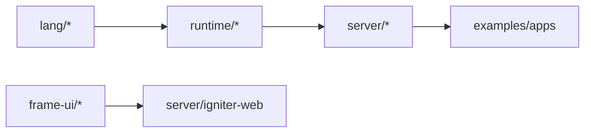

# LAB-IGNITER-ECOSYSTEM-MAP-P1 - Current ecosystem diagrams and explanations

Status: CLOSED
Lane: standard
Type: explanation / architecture map
Delegation code: OPUS-IGNITER-ECOSYSTEM-MAP-P1
Date: 2026-06-20
Skill: idd-agent-protocol

## Intent

Create a clear, current, human-readable map of the Igniter lab ecosystem **as it exists today**.

The goal is not to propose new architecture. The goal is to help Alex and future agents hold the whole
system in their head:

```text
language -> VM -> machine/runtime -> server -> IgWeb -> render/html -> TodoApp/API/UI
```

This should be a durable explanatory packet with diagrams, short narratives, and authority boundaries.
It should make the ecosystem feel navigable rather than like a pile of successful proofs.

## Authority

Lab documentation only. This card may create:

- `lab-docs/lang/lab-igniter-ecosystem-map-p1-v0.md`;
- this card's closing report.

It must not change:

- source code;
- tests;
- Cargo dependencies;
- app fixtures;
- canon/public docs;
- repository layout;
- existing proof docs except for optional one-line links if truly needed.

No new decisions. No canon claim. No roadmap inflation. This is a map of current evidence, not a mandate.

## Dirty Tree Warning

Before editing, check `git status --short`.

There may be parallel uncommitted P4/P22 work in:

- `server/igniter-web/examples/todo_postgres_app/todo_handlers.ig`;
- `server/igniter-web/examples/todo_view_app/*`;
- `server/igniter-web/tests/*`;
- related P4/P22 proof docs/cards.

Do **not** touch, stage, or normalize that work. If you need to mention it, classify it as "parallel
uncommitted work" unless it is already committed by the time you run.

## Verify First

Live code wins over proof-doc archaeology. Before writing the packet, inventory current surfaces:

### Repository / domains

- root directories:
  - `lang/`
  - `runtime/`
  - `server/`
  - `frame-ui/`
  - `apps/`
  - `ide/`
  - `tools/`
  - `archive/`
  - `lab-docs/`
- `Cargo.toml` files under those domains;
- current `git status --short`.

### Core language surfaces

- `lang/igniter-compiler/src/igweb.rs`
- `lang/igniter-compiler/src/parser.rs`
- `lang/igniter-compiler/src/typechecker.rs`
- `lang/igniter-stdlib/stdlib/*.ig`
- `lang/igniter-vm/src/vm.rs`

Confirm current support for:

- `.ig` contracts/types/variants/records/collections;
- `Result` / `Option`;
- `call_contract`;
- `map` / `filter` / `filter_map` if relevant;
- `.igweb` projection dialect and current `Decision` arms.

### Runtime / machine surfaces

- `runtime/igniter-machine/src/`
  - capability/effect host side;
  - `postgres_read.rs`;
  - `postgres_write.rs`;
  - ingress/receipts/idempotency;
- current machine tests:
  - read bridge;
  - write bridge;
  - postgres predicates/typed read if present.

### Server / web surfaces

- `server/igniter-server/src/`
  - `protocol.rs`;
  - `host.rs`;
  - `middleware.rs`;
  - `reload.rs`;
  - `serving_loop.rs`;
  - `effect_host.rs`;
- `server/igniter-web/src/lib.rs`;
- `server/igniter-web/src/bin/igweb-serve.rs`;
- current examples:
  - `todo_app`;
  - `todo_v2_app`;
  - `todo_postgres_app`;
  - `todo_view_app`;
  - any context demo apps.

### Render / UI surfaces

- `frame-ui/igniter-render-html/src/lib.rs`;
- `server/igniter-web/examples/todo_view_app/`;
- `lab-docs/lang/*render*`;
- `lab-docs/lang/*viewartifact*`;
- `frame-ui/igniter-frame` / `igniter-ui-kit` docs or tests if needed.

### Existing proof docs to synthesize

Read only the docs needed to orient the map, likely:

- `lab-docs/lang/lab-igniter-projection-dialects-p0-v0.md`
- `lab-docs/lang/lab-igniter-web-runner-dx-readiness-p11-v0.md`
- `lab-docs/lang/lab-igniter-web-runner-p12-v0.md`
- `lab-docs/lang/lab-igniter-web-context-composition-readiness-p25-v0.md`
- `lab-docs/lang/lab-igniter-web-read-guard-host-p6-v0.md`
- `lab-docs/lang/lab-igniter-web-effect-host-write-p4-v0.md`
- `lab-docs/lang/lab-todoapp-api-read-p3-v0.md`
- latest ViewArtifact/render docs (`P16`-`P22`, as present);
- package / repo boundary docs only if they clarify domain layout.

Do not try to summarize every lab doc. Prefer current code + the latest proof per lane.

## Required Deliverable

Create:

```text
lab-docs/lang/lab-igniter-ecosystem-map-p1-v0.md
```

The document should be concise enough to read in one sitting but rich enough to orient a new agent.

Target length: roughly 250-450 lines. Use headings, Mermaid diagrams, and compact explanatory tables.

## Required Sections

### 1. One-page mental model

Start with the simplest explanation:

```text
Igniter language describes contracts.
Compiler/VM execute pure graph logic.
Machine owns capability execution, receipts, and external effects.
Server owns transport/concurrency.
IgWeb projects web authoring into normal Igniter contracts.
Render/export hosts turn structured descriptors into bytes.
Apps own domain meaning.
```

This section should be readable by a human before looking at any code.

### 2. Domain map of the repo

Include a Mermaid diagram of the current repo/domain layout:



Use accurate names from the live tree. Make clear which directories are language, runtime, server/web,
frame/UI, apps, IDE/tools, archive/docs.

### 3. Dependency / authority map

Explain "who owns what":

- `.ig` / app contracts: product meaning and logical intent;
- compiler/VM: pure execution;
- machine: capability authority, receipts, idempotency, reconcile;
- server: transport, concurrency, middleware, raw response framing;
- IgWeb: projection/build/runner, not server routing authority;
- renderer/export hosts: descriptor-to-bytes, not domain logic;
- operator/host config: DB schema/policy/DSN/target bindings.

Include a table:

| Layer | Owns | Must not own |
|---|---|---|

### 4. Main execution paths

Include separate diagrams for:

1. **Pure `.ig` contract execution**
2. **IgWeb request -> generated Serve -> Decision**
3. **Write effect path**
4. **Read host path**
5. **Render HTML path**

Each diagram should show the boundary between app-authored logic and host authority.

### 5. IgWeb explained

Explain:

- `.igweb` as Projection Dialect;
- lowering to ordinary `.ig` `Serve`;
- route sugar:
  - `scope`;
  - `resource`;
  - nested via `scope + resource`;
  - route-level `via`;
  - context `let` / `guard` / accumulation if present;
- current runner:
  - `igweb.toml`;
  - `igweb-serve`;
  - loopback/bounded;
  - observed effects vs machine-enabled harnesses.

Make explicit: `igniter-server` still has no route table.

### 6. TodoApp as the stitched example

Use TodoApp as the concrete narrative:

- simple Todo app;
- Todo V2 routing shape;
- Todo Postgres-shaped API:
  - read intent;
  - write intent;
  - observed effects;
  - machine write proof;
  - read host proof;
- Todo views:
  - `RespondView`;
  - `Render`;
  - `RenderView`;
  - ViewArtifact helper/list authoring.

Include a "current done / not yet" table.

### 7. Data / Postgres model

Explain the current DB story:

- schema is operator/app-owned;
- `.ig` contracts produce structured `QueryPlan` / `WriteIntent`;
- read host executes policy-gated plans;
- write host executes effect intents and receipts;
- no raw SQL in `.ig`;
- no live DB in the latest Todo proof unless a later card has landed.

Make clear:

- fake executor vs live Postgres;
- typed reads / predicates if already present;
- current gaps: staged read runner, structured effect input if still missing, local-PG e2e if not landed.

### 8. UI / rendering model

Explain:

- JSON-first ViewArtifact;
- raw response seam;
- `igniter-render-html` as descriptor-to-HTML host;
- `Render` vs `RenderView`;
- app-local helper contracts;
- list authoring via `map`;
- conditional lists/select/options status if already present.

Do not introduce `.ig.html` as a decision. Mention it only as future/alternative if relevant.

### 9. What is lab evidence vs canon

This is critical. Include a clear status note:

- lab proof;
- implementation proof;
- readiness doc;
- app example;
- canon/public contract.

State that this document maps the lab state and does not promote any surface to canon.

### 10. Current frontier / next moves

Summarize the likely next cards as of the live tree:

- Todo API write/read-write e2e;
- staged read / runner productization;
- structured effect input if string-only input is a blocker;
- ViewArtifact conditional lists / select options;
- render/export descriptor-to-bytes family;
- package/workspace resolver as a separate lane.

Keep this short and grounded. Do not invent a giant roadmap.

## Diagram Requirements

Include at least 6 Mermaid diagrams:

1. repo/domain layout;
2. high-level layer stack;
3. IgWeb request path;
4. effect write path;
5. read host path;
6. render/html path.

Use labels that are understandable without code context.

## Quality Bar

The document should answer these questions:

- "Where does routing live?"
- "Who executes DB reads and writes?"
- "Why does server not know SparkCRM/Todo/etc.?"
- "What does `.igweb` actually become?"
- "What is the difference between observed `InvokeEffect` and executed effect?"
- "How does HTML get sent if ServerResponse used to be JSON?"
- "What can a user author without Rust today?"
- "What is still fake/proof-only?"
- "What is canon vs lab?"

## Required Verification

Because this is docs-only, no full test matrix is required. Still run:

```bash
git status --short
git diff --check
```

If you quote test counts from other proof docs, either:

- re-run the tests; or
- clearly label them as "from proof doc, not re-run in this card".

Prefer avoiding lots of stale counts; the goal is conceptual clarity.

## Closed Scope

- No code changes.
- No app fixture changes.
- No test changes.
- No Cargo changes.
- No moving files.
- No canon/public docs.
- No new architecture decisions.
- No "everything is done" claims.
- No stale proof-doc claims without live verification.

## Closing Report

Close this card with:

- path to the ecosystem map doc;
- list of diagrams included;
- live surfaces verified;
- any stale/conflicting docs discovered;
- what the map says is the next best implementation lane.

The final report should be compact; the explanatory detail belongs in the document.

---

## Closing Report (2026-06-20)

**Deliverable:** `lab-docs/lang/lab-igniter-ecosystem-map-p1-v0.md` — 352 lines, all 10 required sections.
**Docs-only:** `git diff --check` clean; P4/P22 implementation slices were present during authoring and are
committed separately in this harvest — this card's only files are the map doc + this card.

**Diagrams (8, ≥6 required; 2 validated via the mermaid validator, rest are same-form flowcharts):**
1. the spine (authoring→host); 2. repo/domain layout (subgraphs — validated `valid:true`); 3. pure `.ig`
execution; 4. IgWeb request→Serve→Decision; 5. write effect path (validated `valid:true`); 6. read host
path; 7. Postgres fake/real model; 8. render HTML path.

**Live surfaces verified:** `igweb.rs` lowering; `runtime/igniter-machine` capability + postgres read/write;
`igniter-server` protocol/host/middleware/reload/serving_loop/effect_host; `igniter-web` lib + `igweb-serve`;
`igniter-render-html`; 7 `examples/` apps; latest proof-doc per lane (delegated to two Explore sweeps).
Key grounded facts: `ServerResponse = Json | Raw{bytes,content_type}` (HTML rides the raw seam); server has
**no route table** (routing is the compiled `Serve`); effects are **observed (202) by default, executed only
under `--features machine`** via `MachineEffectHost`→machine ingress→receipt; `Render` vs `RenderView`
(JSON-string vs typed-record) both converge on `render_html`→`text/html` bytes.

**Stale/conflicting docs:** none discovered — proof-doc claims matched live code (the reorg path
`runtime/igniter-machine/` is consistently used). Counts are labelled *(from proof doc)* except the Postgres
read counts I re-ran in P10/P11.

**Next best implementation lane (per the map §10):** **Todo API read-write e2e** over the proven P4/P6
read/write seams, then **live-PG e2e in the web path** + **structured (non-string) effect input** — the two
concrete gaps blocking a real end-to-end TodoApp.
