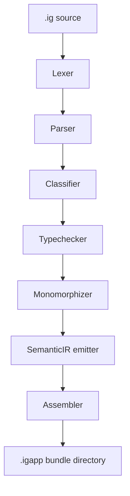

# igniter-compiler

Experimental Rust compiler for Igniter Lab.

`igniter-compiler` parses `.ig` source files and emits structured `.igapp`
bundle directories for lab proofs, IDE inspection, VM candidate testing, and
specification pressure. It is lab-only evidence unless a separate Main Line
route accepts a specific behavior.

This package does not create stable grammar, public API, production runtime,
Reference Runtime, release, performance, certification, or portability
authority.

## Pipeline



Main source modules:

| Module | Role |
| --- | --- |
| [`src/lexer.rs`](./src/lexer.rs) | Tokenization. |
| [`src/parser.rs`](./src/parser.rs) | AST construction. |
| [`src/classifier.rs`](./src/classifier.rs) | Fragment/effect classification. |
| [`src/typechecker.rs`](./src/typechecker.rs) | Type checking and boundary diagnostics. |
| [`src/monomorphizer.rs`](./src/monomorphizer.rs) | Generic/type-shape lowering experiments. |
| [`src/form_registry.rs`](./src/form_registry.rs) | Invocation form registry. |
| [`src/form_resolver.rs`](./src/form_resolver.rs) | Type-directed form resolution experiments. |
| [`src/emitter.rs`](./src/emitter.rs) | SemanticIR emission. |
| [`src/assembler.rs`](./src/assembler.rs) | `.igapp` bundle assembly and sidecar emission. |

## `.igapp` Bundle Shape

A lab `.igapp` bundle is a directory of JSON artifacts. Depending on the proof
path, it may contain:

- `manifest.json`
- `passport.json`
- `semantic_ir_program.json`
- `classified_ast.json`
- `compilation_report.json`
- diagnostics, requirements, projections, form tables, and form resolution
  traces

Generated `.igapp` bundles are output artifacts. Do not treat them as canonical
language authority by copy alone.

## Local Commands

Build or test the compiler from this directory:

```bash
cargo build
cargo test
```

Compile a source fixture:

```bash
cargo run -- compile fixtures/conformance/source/add.ig --out out/add.igapp
```

Run lab verification scripts from the repository root:

```bash
ruby igniter-compiler/verify_compiler.rb
ruby igniter-compiler/verify_loops.rb
ruby igniter-compiler/proofs/contract_invocation_forms_type_directed_dispatch_proof.rb
ruby igniter-compiler/proofs/contract_invocation_forms_semanticir_lowering_proof.rb
```

## Fixtures And Proof Inputs

- [`fixtures/conformance/source/`](./fixtures/conformance/source/) contains
  source fixtures used by local compiler checks.
- [`fixtures/conformance/golden/`](./fixtures/conformance/golden/) contains
  golden fixture material for local parity checks.
- [`fixtures/forms/`](./fixtures/forms/) contains forms/type-dispatch/lowering
  proof inputs.
- [`fixtures/io_*`](./fixtures/) groups IO and capability proof inputs.
- [`proofs/`](./proofs/) contains proof runners.

## Generated Output Policy

Exclude generated output from normal commits unless a specific proof card asks
for an exact artifact:

- `out/`
- `.igapp/`
- `target/`
- generated reports, summaries, traces, receipts, and observations

## Authority Boundary

Accepted wording for this package:

- experimental compiler;
- lab-only proof surface;
- candidate behavior;
- proof-local evidence.

Avoid wording that implies canonical language authority, public runtime support,
stable grammar, production readiness, release status, performance guarantees,
certification, or portability guarantees.
