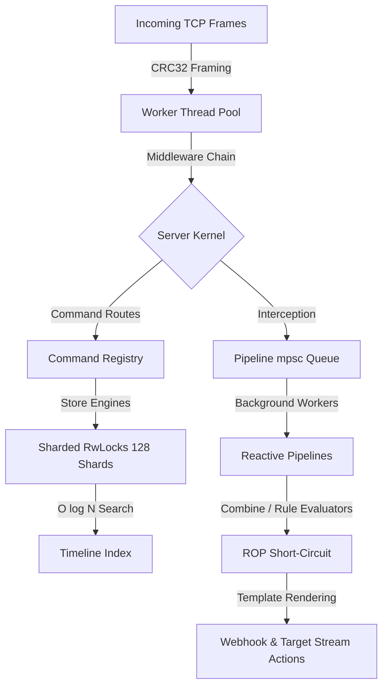

# TBackend Technical Architecture & Core Concepts Guide

This document records lab-local architecture notes for TBackend: an experimental standalone temporal ledger and reactive event backend candidate built in Rust. It is not public runtime, database, production, release, performance, certification, or portability authority.

---

## 1. Technical Design Notes

TBackend explores temporal ledger and reactive pipeline shapes for lab-local workloads. The notes below describe candidate mechanisms and do not make public performance or production claims:



### A. 128-Way Sharded Lock Concurrency (Reducing Lock Contention)
*   **The Problem**: A standard database index locks the entire collection during writes. Under heavy multi-threaded concurrent write and read workloads, a single write lock blocks all concurrent readers and other writers, reducing parallelism to zero.
*   **The Solution**: We partitioned the in-memory index (`ShardedFactLog`) into `128` independent hash-buckets:
    $$\text{Shard Index} = \text{Hash}(\text{Store}, \text{Key}) \pmod{128}$$
    Each shard manages its own `parking_lot::RwLock<ShardInner>`. Writes and reads targeting different stores or keys execute in parallel across CPU cores with reduced lock contention in the lab model.

### B. $O(\log N)$ Logarithmic Temporal Search (Timeline Binary Search)
*   **The Problem**: Traditional time-series lookups perform reverse linear scans ($O(N)$) over a key's commit history to find the active fact at a bitemporal `as_of` coordinate. As historical version depths grow (e.g., 5,000 updates), performance degrades linearly.
*   **The Solution**: Since transactions are appended chronologically, every key's timeline vector is naturally sorted by transaction time. We implemented binary search via Rust's standard `partition_point`:
    ```rust
    let pos = timeline.partition_point(|fact| fact.transaction_time <= as_of);
    ```
    This reduces point lookup complexity to $O(\log N)$. Point reads use binary search over the timeline vector.

### C. P2P WAL Gossip Anti-Entropy Replication (`MeshClusterPack`)
*   **The Problem**: Traditional master-slave replication introduces coordination and availability tradeoffs.
*   **The Solution**: The lab candidate includes a peer-to-peer gossip synchronization pack running out-of-band:
    - Nodes exchange compact state vectors representing active store names and maximum WAL transaction timestamps.
    - Missing segments are identified and pulled incrementally via epsilon-buffered arithmetic.
    - Causal conflicts are validated Git-style using Blake3 content hashes, ensuring replica convergence.

### D. Lock-Free CoW Swapping & Atomic Log Compaction (`SnapshotPack`)
*   **The Problem**: Mutating active sharded memory indexes or WAL files in-place under active write load introduces deadlocks, read corruption, and write amplification.
*   **The Solution**: 
    - **Copy-On-Write Index Swapping**: During a compaction sweep, the compactor aggregates cold facts into bitemporal materialized summaries. It then builds a *fresh* memory index (`ShardedFactLog`) populated *only* with the warm facts, and swaps the active engine reference inside the global registry under a brief write lock.
  - **Atomic Log Compaction**: The compactor writes remaining warm facts to a temporary file (`.wal.tmp`), flushes it, and renames it atomically (`std::fs::rename`) to overwrite the active `.wal` file, using the filesystem rename boundary for the lab compaction model.

### E. Monadic ROP & MobX Reactive Event Engine (`PipelinePack`)
The reactive pipeline engine combines two advanced functional programming paradigms:
1.  **Railway Oriented Programming (ROP)**:
    Pipes are modeled as a series of two-track monadic operations. If any stage (Filter, Combine, Rules evaluation) fails, execution is instantly short-circuited/bypassed (switching to the failure/abort track). Unnecessary side effects (webhook callbacks, target store streaming) are avoided.
2.  **MobX Functional Reactivity**:
    State writes to TBackend act as **State**. The Combine & Rules engines compute dynamic bitemporally synchronized joins, acting as **Derivations/Computed Values**. The out-of-band webhook dispatchers act as **Reactions/Side Effects** that fire automatically when state conditions are met.

### F. Token Authorization & RBAC/ACL Isolation (`AuthPack`)
*   **The Problem**: Exposing a multi-tenant ledger over TCP requires explicit authentication and authorization boundaries. The lab candidate keeps token checks in memory to explore a low-overhead design.
*   **The Solution**: The lab candidate includes an opt-in in-memory security layer:    - **Opt-In Capability**: Controlled via the `--auth-enabled true` flag. If disabled, the middleware short-circuits to `Ok(())` at the front of the chain, preserving compatibility with non-tokenized lab clients.
    - **Multitenant Isolation**: Enforces strict Role-Based Access Control (RBAC) across roles (`admin`, `read_only`, `write_only`, `peer`) and store-level Access Control Lists (ACLs) to prevent partition cross-talk or unauthorized token leaks.

---

## 2. Extension Pack Navigation Map

TBackend is fully modular. It compiles a single statically linked daemon using the **Packet Profile** pattern. Each feature set is encapsulated in a dedicated, trait-driven extension pack:

| Pack Name | Location | Provided Capabilities | Required Cap. / Packs |
|---|---|---|---|
| **`CorePack`** | `src/main.rs` | `bitemporal_ledger` | None (Baseline Engine) |
| **`BaseAuditPack`** | `src/packs/base_audit.rs` | `audit`, `telemetry` | None (Registers global `/metrics`) |
| **`MultiTenantScannerPack`** | `src/packs/multitenant_scanner.rs` | `data_scanning` | `bitemporal_ledger` (Boot warmups) |
| **`MeshClusterPack`** | `src/packs/mesh_cluster.rs` | `mesh_sync`, `wal_gossip` | `bitemporal_ledger`, `base_audit` |
| **`TriggerPack`** | `src/packs/trigger.rs` | `event_triggers` | `bitemporal_ledger`, `base_audit` (Out-of-band webhooks) |
| **`QueryPack`** | `src/packs/query.rs` | `temporal_query`, `pushdown_filtering` | `bitemporal_ledger`, `base_audit` |
| **`AnalyticsPack`** | `src/packs/analytics.rs` | `aggregations`, `time_series_calculations` | `bitemporal_ledger`, `query`, `temporal_query` |
| **`CrossStorePack`** | `src/packs/cross_store.rs` | `temporal_joins` | `bitemporal_ledger` (Inner, Left, Time-Travel Joins) |
| **`SnapshotPack`** | `src/packs/snapshot.rs` | `log_compaction`, `rollups` | `bitemporal_ledger`, `base_audit` |
| **`DiagnosticsPack`** | `src/packs/diagnostics.rs` | `diagnostics_monitoring`| `audit`, `base_audit` (Footprint estimators) |
| **`PipelinePack`** | `src/packs/pipeline.rs` | `reactive_pipelines` | `bitemporal_ledger`, `base_audit` (ROP & MobX) |
| **`AuthPack`** | `src/packs/auth.rs` | `access_control`, `rbac_enforcement` | `base_audit`, `audit` (Opt-in Token Security) |
| **`McpPack`** | `src/packs/mcp.rs` | `mcp_interface` | `bitemporal_ledger`, `base_audit` (Native stdio MCP tools) |

---

## 3. Core System Internals

### A. Micro-packet Wire Protocol
Communication between clients (REPL, ActiveRecord Ruby CDYLIB) and the daemon occurs over raw TCP streams using a big-endian length-framed CRC32-validated binary packet structure:

```text
┌────────────────────────┬──────────────────────────────────┬────────────────────────┐
│  Body Length (4 bytes) │    JSON Body (N bytes UTF-8)     │  Body CRC32 (4 bytes)  │
├────────────────────────┼──────────────────────────────────┼────────────────────────┤
│  Big-Endian u32        │  { "op": "write_fact", ... }     │  Big-Endian u32        │
└────────────────────────┴──────────────────────────────────┴────────────────────────┘
```
This protects network streams against packet fragmentation, truncation, or network corruption.

### B. In-Memory Footprint Estimation Formula
`DiagnosticsPack` calculates in-memory RAM allocations on-the-fly using deep serialization inspection.
1.  **JSON Value Size** ($S_{json}$):
    - **Null / Boolean**: `1 byte`
    - **Number**: `8 bytes` (f64)
    - **String** ($s$): `24 bytes` (Vector stack metadata) + $len(s)$
    - **Array** ($arr$): `24 bytes` + $\sum S_{json}(item)$
    - **Object** ($obj$): `48 bytes` (HashMap metadata) + $\sum (24 + len(key) + S_{json}(val))$
2.  **Fact Metadata Size** ($S_{fact}$):
    Sum of string allocations (ID, Store, Key, value_hash, causation, producer, derivation) + f64 timestamps + schema version + $S_{json}(value)$.
    Provides operators with precise real-time RAM metrics.

---

## 4. Security & Access Control Architecture (`AuthPack`)

The `AuthPack` implements request-level token validation, Role-Based Access Control (RBAC), and store-level Access Control List (ACL) isolation inside a highly performant and non-blocking Rust architecture.

### A. Dynamic Token Registry & Memory Model
Tokens are registered in memory inside a centralized `TokenRegistry` wrapped in a thread-safe `RwLock`:
```rust
pub struct TokenConfig {
    pub token: String,
    pub role: String, // admin, read_only, write_only, peer
    pub allowed_stores: Vec<String>, // e.g. ["*"] or ["store_name"]
    pub persist: bool,
}
```
*   **Request Interception**: The `AuthMiddleware` implements the `RequestMiddleware` trait and sits at the very front of the middleware chain. Credential and permission checks are performed through the in-memory token registry before command dispatch.
*   **Monadic Verification (ROP Pipeline)**: Every incoming JSON request frame is parsed and routed through sequential validation filters:
    ```text
    Request Frame 
         │
         ▼ (Enabled Check)
    [auth_enabled == true?] ──No──► [Bypass - Ok]
         │
        Yes
         ▼ (Token Extraction)
    ['token' supplied?] ──────No──► [Auth Failed: Missing Token]
         │
        Yes
         ▼ (Registry Lookup)
    [Resolve TokenConfig] ────No──► [Auth Failed: Invalid Token]
         │
        Yes
         ▼ (RBAC Authorization)
    [Validate OP Perms] ──────No──► [Access Denied: Role Violation]
         │
        Yes
         ▼ (ACL Authorization)
    [Validate Store ACLs] ────No──► [Access Denied: ACL Violation]
         │
        Yes
         ▼
    [Proceed to Command - Ok]
    ```

### B. Fine-Grained Role-Based Access Control (RBAC)
Role policies map exact bitemporal operation capability limits:
*   **`admin`**: Total access to all server routes, command registry configurations, and token management routes.
*   **`read_only`**: Strictly restricted to query routes. Blocks any writes or configuration mutations.
    *   *Allowed Operations*: `ping`, `latest_for`, `facts_for`, `query_scope`, `size`, `stores`, `diagnostics_summary`, `diagnostics_stores`, `query_slice`, `analytics_aggregate`, `analytics_calculate`, `analytics_metrics`, `cross_store_query`, `cross_store_join`.
*   **`write_only`**: Restricted strictly to standard ingestion routes.
    *   *Allowed Operations*: `ping`, `write_fact`.
*   **`peer`**: Restricted strictly to gossip replication and anti-entropy sync routes.
    *   *Allowed Operations*: `ping`, `mesh_ping`, `mesh_gossip`, `mesh_sync_pull`.

### C. Store ACL Isolation
To support multi-tenant database safety and prevent cross-tenant partition leaks, `AuthMiddleware` recursively audits target store fields in request payloads:
1.  **Single Store**: Audits `store` or `fact.store` fields.
2.  **Cross-Store Query**: Sweeps the nested array under `queries` to ensure every queried store is whitelisted.
3.  **Cross-Store Join**: Sweeps both `left_store` and `right_store` fields to ensure authorization.
4.  **Wildcard Matching**: Whitelists matches for exact store names or the `*` wildcard (which grants access to all store partitions).

### D. Durable Lifecycle & Bootstrapping
*   **Durable Preloads**: Configs with `persist: true` are written as pretty-printed JSON files to `<data_dir>/security/<token_value>.json`. Upon bootstrap, `MultiTenantScannerPack` sweeps this folder and loads active keys.
*   **First-Boot Bootstrapping**: If no persistent keys are detected, the server automatically generates a default administrator token `admin_default` with `*` access and persists it to `<data_dir>/security/admin_default.json` to secure the system out-of-the-box.
*   **Lockout Prevention**: The command handler for `auth_token_delete` validates that the registry contains at least one other active admin token before deleting the requested key.

