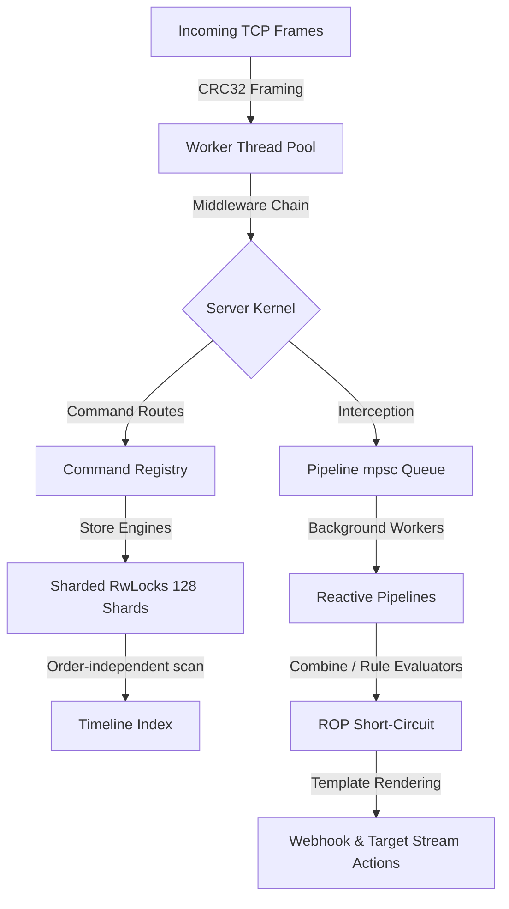

# TBackend Technical Architecture & Core Concepts Guide

This document records architecture notes for TBackend: an implemented Rust
temporal-ledger daemon used for Spark-shaped shadow systems, audit, replay, and
explainability work. It describes how the current preview works and which gates
matter before deeper production use.

Status language:

```text
implemented core
  -> ready for local/team preview
  -> intended first use: shadow side ledger
  -> source-of-truth promotion only after convergence + operator gate
```

This distinction keeps adoption simple. Start with the low-risk fit: shadow
side-ledger, replay, point-in-time explanation, and parity evidence. SparkCRM or
other production systems keep their existing source of truth until a separate
promotion decision says otherwise.

---

## 1. Technical Design Notes

TBackend implements temporal ledger and reactive pipeline mechanisms for
bounded local/team workloads. The notes below describe mechanisms and the
evidence still needed for broader production roles:



### A. 128-Way Sharded Lock Concurrency (Reducing Lock Contention)
*   **The Problem**: A standard database index locks the entire collection during writes. Under heavy multi-threaded concurrent write and read workloads, a single write lock blocks all concurrent readers and other writers, reducing parallelism to zero.
*   **The Solution**: We partitioned the in-memory index (`ShardedFactLog`) into `128` independent hash-buckets:
    $$\text{Shard Index} = \text{Hash}(\text{Store}, \text{Key}) \pmod{128}$$
    Each shard manages its own `parking_lot::RwLock<ShardInner>`. Writes and
    reads targeting different stores or keys execute in parallel across CPU
    cores with reduced lock contention. Treat this as design and lab evidence;
    production capacity claims require dedicated load and failure-mode evidence.

### B. $O(N)$ Order-Independent Temporal Search (Correctness Over Version Depth)
*   **The Problem**: A key's timeline vector is stored in **arrival order**, which is *not* guaranteed to be transaction-time order. Facts can arrive out of order under retries, backfills, and corrections (e.g. tx=100, tx=300, tx=200 appended in that sequence). A binary search (`partition_point`) assumes a sorted slice and therefore silently drops in-window facts, leaks out-of-window facts, and mis-resolves the active fact at an `as_of` coordinate.
*   **The Solution**: Point reads (`latest_for`) and windowed reads (`facts_for_key`, `facts_for_store`, `query_scope`) scan the key's timeline and select by `transaction_time` directly — order-independent and correct regardless of insertion order. Windowed reads sort the selected rows by `transaction_time` for stable output:
    ```rust
    timeline.iter()
        .filter(|fact| fact.transaction_time <= as_of)
        .max_by(by_transaction_time)   // latest_for / query_scope
    ```
    This is $O(N)$ in the version depth of a single key — correctness-first over wall-clock reads. **`seq_id` has since landed (LAB-TBACKEND-SEQID-PER-STORE-P9):** the server assigns a per-store monotonic `seq_id` at `write_fact_once` time (the replay order; `transaction_time` is evidence, `valid_time` is domain time). The new `facts_by_seq(store, after, until)` read is **clock-free** — filter + sort by `seq_id`, correct regardless of arrival order — and is the right read for replay/audit. tt-based reads (`latest_for`, windowed) keep the correctness-first scan; an `O(\log N)` `partition_point` over the seq-sorted path is a safe later optimization.

### C. P2P WAL Gossip Anti-Entropy Replication (`MeshClusterPack`)
*   **The Problem**: Traditional master-slave replication introduces coordination and availability tradeoffs.
*   **The Solution**: The lab candidate includes a peer-to-peer gossip synchronization pack running out-of-band:
    - Nodes exchange compact state vectors representing active store names and maximum WAL transaction timestamps.
    - Missing segments are identified and pulled incrementally via epsilon-buffered arithmetic.
    - Causal conflicts are validated Git-style using Blake3 content hashes, ensuring replica convergence.

### D. Lock-Free CoW Swapping & Atomic Log Compaction (`SnapshotPack`)
*   **The Problem**: Mutating active sharded memory indexes or WAL files in-place under active write load introduces deadlocks, read corruption, and write amplification.
*   **The Solution**: 
    - **Copy-On-Write Index Swapping**: During a compaction sweep, the compactor aggregates cold facts into bitemporal materialized summaries. It then builds a *fresh* memory index (`ShardedFactLog`) populated *only* with the warm facts, and swaps the active engine reference inside the global registry under a brief write lock.
  - **Atomic Log Compaction**: The compactor writes remaining warm facts to a temporary file (`.wal.tmp`), flushes it, and renames it atomically (`std::fs::rename`) to overwrite the active `.wal` file, using the filesystem rename boundary for the lab compaction model.
*   **⚠ Safety status (LAB-TBACKEND-COMPACTION-SAFETY-GATE-P6, DISABLED by default):** the "brief write lock" above spans only the engine *swap*, **not** the read→build→swap critical section. Any write that lands while a sweep is between its `facts_for_store` snapshot and the `engines.insert` swap is appended to the old engine and discarded — a silent loss of an acknowledged write (proven: `scripts/verify/verify_compaction_loss.py` lost 19/28 concurrent acked writes). The rename is also **not** durability-safe: the temp WAL is `flush`ed but not `fsync`ed, and neither the file nor the directory is fsynced after `rename`, so a crash mid-compaction can leave a WAL missing history (routed to the durable-ack/fsync card). Because of this, the background sweep was first **disabled by default**. **Superseded (LAB-TBACKEND-SAFE-COMPACTION-STOP-THE-WORLD-P12):** compaction is now **safe manual**, not merely disabled. The destructive auto-sweep is gone; compaction runs only on operator trigger with `--enable-compaction` (the `--unsafe-compaction` flag is removed). It runs under a **per-store stop-the-world gate** that blocks new writes and drains in-flight ones across the entire read→build→swap window (kills the 19/28 acked-loss — re-proven 0/11), plus a **durable rename** `fsync(tmp) → rename → fsync(dir) → swap` (kills the un-fsynced-rename hazard); `load_replayed` preserves/back-fills `seq_id` across the swap. Still off by default; the v1 short-pause delta is deferred. This remains a lab compaction model, **not** a production capacity claim.

### D2. Ack Durability — accepted vs durable (LAB-TBACKEND-DURABLE-ACK-GROUP-COMMIT-P6)
*   **The honesty ladder.** An ack carries an explicit `durability`:
    - `in_memory` — appended to the in-memory `ShardedFactLog` only (ephemeral `data_dir=None`); lost on any restart.
    - `accepted` — `write(2)` returned, frame is in the OS page cache. Survives a **process crash** (SIGKILL), **not** power loss. **This is the default** and the right mode for the high-volume shadow path where the Hub is not the source of truth.
    - `durable` — an `fdatasync` covering this write returned, so it is on the storage device (to the extent the device honors fsync; consumer SD/SSD caches may lie).
*   **Group commit.** `durable` is opt-in (server `--durability durable`, or per-request `"durability":"durable"`, mirroring the P4 `strict_hash` field). Per-write fsync would be throughput-fatal under the global `write_once_lock`, so durable writers coalesce: `FileBackend::commit_durable` runs a bounded window (`--commit-interval-ms`, default 5; flush early at `--commit-max-batch`, default 256), one writer leads a single `fdatasync` (on a dup'd fd, **outside** both the write-once lock and the append mutex), and all writers it covered ack `durable`. Proven: 24 concurrent durable writes → 3 fdatasyncs (`scripts/verify/verify_durable_ack.py`).
*   **No false durability.** Ephemeral mode downgrades `durable` to `in_memory` (never claims durable). An `fdatasync` failure fails the ack with `committed:false, retryable:true` — never a silent downgrade. CI proves the sync *path* via a `sync_count` seam; true power-loss survival is a separately gated hardware proof.
*   **Closed (P12):** compaction's temp-WAL rename is now durable (`fsync(tmp) → rename → fsync(dir)`), resolving the earlier un-fsynced-rename gap (audit B4); compaction is safe-manual and still off by default (§D).

### D3. Server-owned write core — content hash + write-once (LAB-TBACKEND-CANONICAL-HASH-P4 / SEQID-P9)
The `write_fact_once` path is server-owned end to end:
*   **Content hash.** The server always recomputes `value_hash` as a Blake3 over a key-order-independent serialization (`pure_core::canonical_value_hash`) and stamps it (`enforce_canonical_hash`); a `strict` mode rejects a disagreeing client hash (`value_hash_mismatch`). Clients cannot poison content identity — a correction over the earlier "client supplies `value_hash`" model. Client `transaction_time` is recorded as evidence only.
*   **Write-once dedup.** `push_once` dedups by `(store, id)`: an identical re-send (same id + canonical hash + value) returns `Replay` with the **original** `seq_id`; a same-id / different-content write returns `Conflict` (`duplicate_fact_id_conflict`, not retryable). Idempotent retries converge instead of duplicating — **provided the caller derives a stable, domain-deterministic `id`** (wall-clock in the id breaks idempotency; use a domain version such as `updated_at` / `lock_version`).

### D4. Current status & known gaps (verify-first, 2026-06-29)
Honest state so readers don't infer more than the code delivers (full audit: `igniter-home-lab/cards/LAB-TBACKEND-CORE-FOUNDATION-AUDIT-P1.md`):
*   ✅ **Closed:** server `seq_id` replay order (§B), server-stamped content hash (§D3), durable group-commit ack (§D2), safe manual compaction (§D), domain-deterministic idempotent write (§D3).
*   ⚠ **Mesh gossip is readiness-design, not wired:** `mesh_cluster.rs` still pulls by client `transaction_time`, so cross-node **clock skew can silently drop writes** (seq-watermark fix `LAB-TBACKEND-MESH-SEQ-WATERMARK-P13` is designed, not yet in code). Do not rely on multi-node convergence under skew.
*   ⚠ **WAL recovery is silent on mid-file corruption:** `replay_pure` stops at the first bad record with no count / quarantine. Lower probability now (durable fsync ⇒ fewer torn tails), but a mid-file corruption truncates everything after, silently.
*   ⚠ **Two cores:** the daemon (`pure_core`, the product) is internally coherent; the opt-in FFI path (`fact.rs`, `--features ffi`) still defines a divergent `FactData` without `seq_id` — collapse pending.
*   ⚠ **Reactive webhooks (`PipelinePack`) are at-most-once:** in-memory queue, fire-and-forget delivery, no retry / DLQ; a crash between ack and dispatch drops the reaction.

### E. Monadic ROP & MobX Reactive Event Engine (`PipelinePack`)
The reactive pipeline engine combines two advanced functional programming paradigms:
1.  **Railway Oriented Programming (ROP)**:
    Pipes are modeled as a series of two-track monadic operations. If any stage (Filter, Combine, Rules evaluation) fails, execution is instantly short-circuited/bypassed (switching to the failure/abort track). Unnecessary side effects (webhook callbacks, target store streaming) are avoided.
2.  **MobX Functional Reactivity**:
    State writes to TBackend act as **State**. The Combine & Rules engines compute dynamic bitemporally synchronized joins, acting as **Derivations/Computed Values**. The out-of-band webhook dispatchers act as **Reactions/Side Effects** that fire automatically when state conditions are met.

### F. Token Authorization & RBAC/ACL Isolation (`AuthPack`)
*   **The Problem**: Exposing a multi-tenant ledger over TCP requires explicit authentication and authorization boundaries. The lab candidate keeps token checks in memory to explore a low-overhead design.
*   **The Solution**: The lab candidate includes an opt-in in-memory security layer:    - **Opt-In Capability**: Controlled via the `--auth-enabled true` flag. If disabled, the middleware short-circuits to `Ok(())` at the front of the chain, preserving compatibility with non-tokenized lab clients.
    - **Multitenant Isolation**: Enforces strict Role-Based Access Control (RBAC) across roles (`admin`, `read_only`, `write_only`, `peer`) and store-level Access Control Lists (ACLs) to prevent partition cross-talk or unauthorized token leaks.

---

## 2. Promotion Ladder

Use this ladder when deciding whether TBackend belongs in a system:

| Stage | Meaning | Allowed usage |
| --- | --- | --- |
| Local proof | Synthetic or local proof, no business authority | feature and protocol exploration |
| Shadow side-ledger | Existing system remains source of truth; TBackend mirrors and explains | Spark-shaped availability audit, point-in-time replay, parity packets |
| Candidate production dependency | TBackend is on the critical path but still behind fallback/reconcile gates | only after shadow convergence + runbook + rollback |
| Source-of-truth role | TBackend is a source of truth for a bounded domain | explicit operator/business gate, not implied by this repo |

For Spark availability, the current desired status is **shadow side-ledger**.
Rails/Postgres remains authoritative; TBackend records lineage, replay, and
explainability. Convergence and stability evidence can later justify promotion.

## 3. Extension Pack Navigation Map

TBackend is fully modular. It compiles a single statically linked daemon using the **Packet Profile** pattern. Each feature set is encapsulated in a dedicated, trait-driven extension pack:

| Pack Name | Location | Provided Capabilities | Required Cap. / Packs |
|---|---|---|---|
| **`CorePack`** | `src/main.rs` | `bitemporal_ledger` | None (Baseline Engine) |
| **`BaseAuditPack`** | `src/packs/base_audit.rs` | `audit`, `telemetry` | None (Registers global `/metrics`) |
| **`MultiTenantScannerPack`** | `src/packs/multitenant_scanner.rs` | `data_scanning` | `bitemporal_ledger` (Boot warmups) |
| **`MeshClusterPack`** | `src/packs/mesh_cluster.rs` | `mesh_sync`, `wal_gossip` | `bitemporal_ledger`, `base_audit` |
| **`TriggerPack`** | `src/packs/trigger.rs` | `event_triggers` | `bitemporal_ledger`, `base_audit` (Out-of-band webhooks) |
| **`QueryPack`** | `src/packs/query.rs` | `temporal_query`, `pushdown_filtering` | `bitemporal_ledger`, `base_audit` |
| **`AnalyticsPack`** | `src/packs/analytics.rs` | `aggregations`, `time_series_calculations` | `bitemporal_ledger`, `query`, `temporal_query` |
| **`CrossStorePack`** | `src/packs/cross_store.rs` | `temporal_joins` | `bitemporal_ledger` (Inner, Left, Time-Travel Joins) |
| **`SnapshotPack`** | `src/packs/snapshot.rs` | `log_compaction`, `rollups` | `bitemporal_ledger`, `base_audit` |
| **`DiagnosticsPack`** | `src/packs/diagnostics.rs` | `diagnostics_monitoring`| `audit`, `base_audit` (Footprint estimators) |
| **`PipelinePack`** | `src/packs/pipeline.rs` | `reactive_pipelines` | `bitemporal_ledger`, `base_audit` (ROP & MobX) |
| **`AuthPack`** | `src/packs/auth.rs` | `access_control`, `rbac_enforcement` | `base_audit`, `audit` (Opt-in Token Security) |
| **`McpPack`** | `src/packs/mcp.rs` | `mcp_interface` | `bitemporal_ledger`, `base_audit` (Native stdio MCP tools) |

---

## 4. Core System Internals

### A. Micro-packet Wire Protocol
Communication between clients (REPL, ActiveRecord Ruby CDYLIB) and the daemon occurs over raw TCP streams using a big-endian length-framed CRC32-validated binary packet structure:

```text
┌────────────────────────┬──────────────────────────────────┬────────────────────────┐
│  Body Length (4 bytes) │    JSON Body (N bytes UTF-8)     │  Body CRC32 (4 bytes)  │
├────────────────────────┼──────────────────────────────────┼────────────────────────┤
│  Big-Endian u32        │  { "op": "write_fact", ... }     │  Big-Endian u32        │
└────────────────────────┴──────────────────────────────────┴────────────────────────┘
```
This protects network streams against packet fragmentation, truncation, or network corruption.

### B. In-Memory Footprint Estimation Formula
`DiagnosticsPack` calculates in-memory RAM allocations on-the-fly using deep serialization inspection.
1.  **JSON Value Size** ($S_{json}$):
    - **Null / Boolean**: `1 byte`
    - **Number**: `8 bytes` (f64)
    - **String** ($s$): `24 bytes` (Vector stack metadata) + $len(s)$
    - **Array** ($arr$): `24 bytes` + $\sum S_{json}(item)$
    - **Object** ($obj$): `48 bytes` (HashMap metadata) + $\sum (24 + len(key) + S_{json}(val))$
2.  **Fact Metadata Size** ($S_{fact}$):
    Sum of string allocations (ID, Store, Key, value_hash, causation, producer, derivation) + f64 timestamps + schema version + $S_{json}(value)$.
    Provides operators with precise real-time RAM metrics.

---

## 5. Security & Access Control Architecture (`AuthPack`)

The `AuthPack` implements request-level token validation, Role-Based Access Control (RBAC), and store-level Access Control List (ACL) isolation inside a highly performant and non-blocking Rust architecture.

### A. Dynamic Token Registry & Memory Model
Tokens are registered in memory inside a centralized `TokenRegistry` wrapped in a thread-safe `RwLock`:
```rust
pub struct TokenConfig {
    pub token: String,
    pub role: String, // admin, read_only, write_only, peer
    pub allowed_stores: Vec<String>, // e.g. ["*"] or ["store_name"]
    pub persist: bool,
}
```
*   **Request Interception**: The `AuthMiddleware` implements the `RequestMiddleware` trait and sits at the very front of the middleware chain. Credential and permission checks are performed through the in-memory token registry before command dispatch.
*   **Monadic Verification (ROP Pipeline)**: Every incoming JSON request frame is parsed and routed through sequential validation filters:
    ```text
    Request Frame 
         │
         ▼ (Enabled Check)
    [auth_enabled == true?] ──No──► [Bypass - Ok]
         │
        Yes
         ▼ (Token Extraction)
    ['token' supplied?] ──────No──► [Auth Failed: Missing Token]
         │
        Yes
         ▼ (Registry Lookup)
    [Resolve TokenConfig] ────No──► [Auth Failed: Invalid Token]
         │
        Yes
         ▼ (RBAC Authorization)
    [Validate OP Perms] ──────No──► [Access Denied: Role Violation]
         │
        Yes
         ▼ (ACL Authorization)
    [Validate Store ACLs] ────No──► [Access Denied: ACL Violation]
         │
        Yes
         ▼
    [Proceed to Command - Ok]
    ```

### B. Fine-Grained Role-Based Access Control (RBAC)
Role policies map exact bitemporal operation capability limits:
*   **`admin`**: Total access to all server routes, command registry configurations, and token management routes.
*   **`read_only`**: Strictly restricted to query routes. Blocks any writes or configuration mutations.
    *   *Allowed Operations*: `ping`, `latest_for`, `facts_for`, `query_scope`, `size`, `stores`, `diagnostics_summary`, `diagnostics_stores`, `query_slice`, `analytics_aggregate`, `analytics_calculate`, `analytics_metrics`, `cross_store_query`, `cross_store_join`.
*   **`write_only`**: Restricted strictly to standard ingestion routes.
    *   *Allowed Operations*: `ping`, `write_fact`.
*   **`peer`**: Restricted strictly to gossip replication and anti-entropy sync routes.
    *   *Allowed Operations*: `ping`, `mesh_ping`, `mesh_gossip`, `mesh_sync_pull`.

### C. Store ACL Isolation
To support multi-tenant database safety and prevent cross-tenant partition leaks, `AuthMiddleware` recursively audits target store fields in request payloads:
1.  **Single Store**: Audits `store` or `fact.store` fields.
2.  **Cross-Store Query**: Sweeps the nested array under `queries` to ensure every queried store is whitelisted.
3.  **Cross-Store Join**: Sweeps both `left_store` and `right_store` fields to ensure authorization.
4.  **Wildcard Matching**: Whitelists matches for exact store names or the `*` wildcard (which grants access to all store partitions).

### D. Durable Lifecycle & Bootstrapping
*   **Durable Preloads**: Configs with `persist: true` are written as pretty-printed JSON files named by the **opaque hash** `<data_dir>/security/<token_hash>.json` (mode `0600`, dir `0700`). The body stores `token_hash` and metadata only — **never the plaintext token**. Upon bootstrap the scanner sweeps this folder; files not in the hash/id format (e.g. legacy plaintext token files) are **refused** (fail-closed) rather than loaded as credentials.
*   **First-Boot Bootstrapping**: If no persistent keys are detected, the server mints a **random** administrator token with `*` access. Only its `blake3` hash is persisted; the plaintext is written **once** to `<data_dir>/security/BOOTSTRAP_ADMIN_TOKEN` (mode `0600`) for the operator to retrieve and then delete. No fixed/default token value exists.
*   **Token Lookup**: Requests present the bearer token in `token`; the middleware looks it up by `blake3(token)`, so the plaintext is never stored or compared directly. `auth_token_create` generates the token server-side and returns it once; `auth_token_list` exposes opaque ids + metadata only; `auth_token_delete` addresses tokens by id.
*   **Lockout Prevention**: The command handler for `auth_token_delete` refuses to delete the **last remaining admin** token (counts admin-role tokens before removal).
