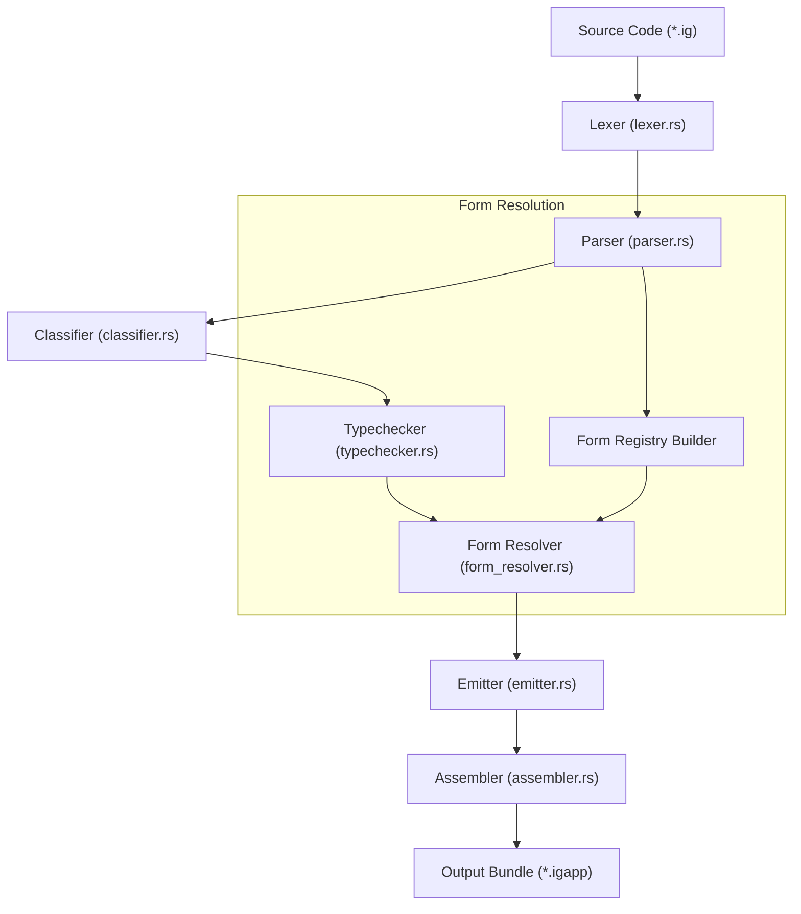

# Analysis of Igniter-Lang Contract Invocation Forms

This document provides a technical analysis of the **Contract Invocation Forms** system implemented in the lab-local proof (`LAB-FORMS-P1`), evaluates the current compilation pipeline, and outlines the gaps remaining to close the full execution cycle from source syntax to runtime VM execution.

---

## 1. System Overview & Current Pipeline

The lab-local implementation (`igniter-lab/igniter-compiler`) proves a type-blind parsing and post-typecheck resolution model for forms.

### The Current Pipeline



### Current Status (P1–P12 Proof Accomplished)
*   **Keywords & Syntax**: Added keywords like `form`, `no_form`, `priority`, `associativity`, `hiding`, `overriding`.
*   **Type-Blind Parsing**: Operators like `+` parse as generic, type-blind `Expr::BinaryOp` nodes, protecting the parser from type dependencies.
*   **Form Registry**: Aggregates form templates and enforces structural rules (e.g., `F-01` block precedence, `F-02` single binder, `F-05` symbolic infixes).
*   **Opt-out via `no_form`**: Correctly fails closed if a client attempts to use form syntax on a contract marked `no_form`.
*   **Trace & Evidence**: Static resolution outputs `form_table.json` and `form_resolution_trace.json` containing resolution events (`resolved`, `miss`, `ambiguity_error`).

---

## 2. Gaps for a Closed Execution Cycle

To transition from the current "trace-only" evidence proof to a fully functioning language pipeline where form syntax is executed by the VM, we must address the following five engineering gaps.

### Gap A: AST Lowering (Desugaring)
> [!IMPORTANT]
> The biggest compiler gap is that the AST is not actually modified during compilation.

Currently, the resolver emits a resolution trace, but the output `semantic_ir_program.json` in the `.igapp` still contains the original `BinaryOp { op: "+" }` node.
*   **Problem**: When the VM compiles this `.igapp` to bytecode, it translates the unresolved `+` operator directly to the primitive arithmetic instruction `OP_ADD`. It has no knowledge that it should call a custom contract (e.g., `Add`).
*   **Solution**: The `FormResolver` must perform **AST rewriting**. It must swap the generic `BinaryOp` with a `Call` node targeting the resolved contract:
    ```diff
    - Expr::BinaryOp { op: "+", left: a, right: b }
    + Expr::Call { fn_name: "Add", args: [a, b] }
    ```

### Gap B: Type-Directed Dispatch
*   **Problem**: Current form resolution is name/trigger-based only. If a user writes `a + b`, the resolver looks up `+` in the registry and picks the candidate. If there are multiple candidates (e.g., `Numeric.Add` and `String.Concat`), it throws an ambiguity error.
*   **Solution**: Disambiguation must be **type-directed**:
    1.  The `TypeChecker` must annotate every AST expression node with its inferred or declared type.
    2.  The `FormResolver` must check these types against the signatures of the candidate contracts in the registry.
    3.  Only candidates matching the operand types survive (integrating with `PROP-016` traits and monomorphization).

### Gap C: Scope Control (Hiding / Overriding)
*   **Problem**: While the parser successfully recognizes `import Module hiding (...) overriding (...)`, these rules are not yet wired to the Form Registry or Resolver.
*   **Solution**: The resolver must maintain a scope table for each contract, filtering out hidden form entries and prioritizing overrides when selecting candidate contracts for a trigger token.

### Gap D: Inter-Contract Calls in the VM (Linking)
*   **Problem**: The VM compiler compiles one contract to bytecode. The VM instruction `OP_CALL` only executes a hardcoded list of stdlib primitives (like `count`, `length`, etc.). If it encounters a call to another contract (like `Add` or `Concat`), it fails:
    `OP_CALL: Unknown/unimplemented function 'Add' with 2 arguments`.
*   **Solution**:
    - **Inlining/Monomorphization**: The compiler can flatten/inline called contracts into the caller graph prior to bytecode generation.
    - **Subroutine Calls**: The VM compiler and execution engine must support linking. When `OP_CALL` targets another contract in the loaded `.igapp`, the VM must push a new frame, bind inputs, run the target contract's instructions, and return the result.

### Gap E: Complete FormKinds & Desugaring
*   **Problem**: Standard libraries require complex patterns like `MultiKeywordForm` (`match`) and folds/reductions which aren't desugared yet.
*   **Solution**:
    -   **Match desugaring**: Lower `MultiKeywordForm` (`match`) to a chain of condition jumps (`OP_JMP_UNLESS`) or structured dispatch table in the bytecode.
    -   **Accumulator / Folds**: Map `AccumulatorRef` (`[sum from 0]`) in block method forms to a loop node initializer and a state-accumulating loop body.

---

## 3. Proposed Action Plan

We can close the syntax-to-execution loop in three distinct slices:

```text
    section Slice 1: AST Rewriting
    Lowering in Resolver
    VM Primitive Fallback
    section Slice 2: VM Linking
    OP_CALL Subroutine Frame
    Multi-Contract Bundling
    section Slice 3: Disambiguation
    Type-Directed Filter
    Import Hiding/Overriding
```

### Slice 1: AST Lowering (Desugaring)
Make form resolution rewrite `BinaryOp`/`UnaryOp` to explicit `Call` expressions before `Emitter` writes the `semantic_ir_program`. Verify that the VM compiler compiles the rewritten `Call` nodes into bytecode.

### Slice 2: VM Inter-Contract Calls
Equip the VM with a local contract registry loader. Implement dynamic linking inside the VM stack executor so that calling another contract shifts execution to its bytecode block and returns.

### Slice 3: Type & Import Disambiguation
Integrate the typed AST from the `TypeChecker` into `FormResolver` so candidates are filtered based on operand types and import rules (`hiding`/`overriding`).
