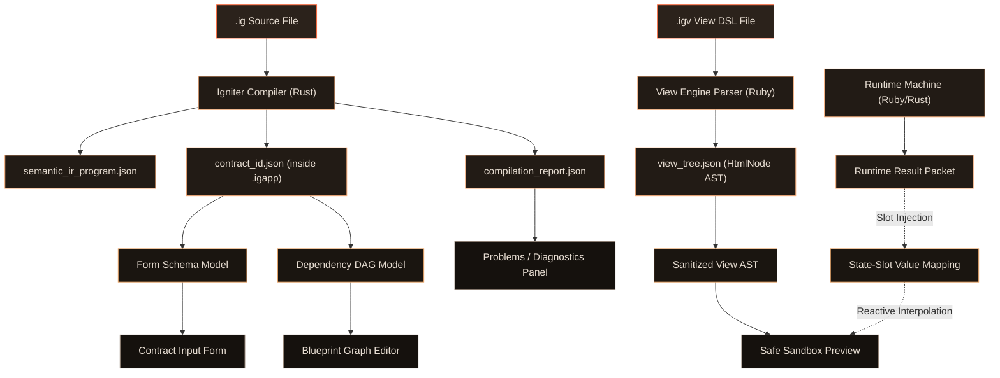

# Igniter Lang -> GUI Research Boundary

Status: `experimental · lab-only · research`
Track: `lab-igniter-lang-to-gui-research-boundary-v0`
Base: `Language Covenant (Postulate 27 & 28)`, `PROP-Forms-Enhanced-v0.md`, `lab-experimental-view-tree-safe-policy-edgecases-and-state-slot-preflight-v0.md`

---

## 1. Context & Goal

This document establishes the **research boundary and architectural pipeline** for translating Igniter Lang compiled artifacts, DSL expressions, runtime outcomes, and view-trees into inspectable, previewable, and interactive GUI surfaces.

Within the `igniter-lab` playground, we pressure-test these interfaces to bridge compiler-driven validation with visual developer ergonomics. We explicitly define what remains a **lab-only prototype** versus what is a **candidate specification input** for future compiler and language iterations, ensuring no canonical authority is claimed prematurely.

---

## 2. Artifact Pipeline

### 2.1 Pipeline Mapping Matrix

| Source Artifact | Intermediate GUI Model | Preview/IDE Surface | Authority Status |
| :--- | :--- | :--- | :--- |
| **`.ig` Source File** | Syntax AST / Token Stream | Source Editor / Syntax Highlighting / Inline Squiggles | **Lab-Only** (IDE integrations) |
| **`semantic_ir_program.json`** | Module Topology Graph | Module/Namespace Tree Explorer | **Lab-Only** (Metadata view) |
| **`compilation_report.json`** | Diagnostic / Error Collection | Problems List / Canvas Warning Overlays | **Lab-Only** (Diagnostics view) |
| **`contract_id.json` (inside `.igapp`)** | Dependency DAG / Form Schema | Blueprint Canvas / Auto-Generated Input Forms | **Candidate Spec Input** (Contract API representation) |
| **`diagnostics.json`** | Execution Trace & Timeline Log | Debugger Panel / Trace Event Timeline | **Lab-Only** (Execution tooling) |
| **`token_usage_report.json`** | CSS Class Usage Frequency Matrix | Design System Conformance Inspector | **Lab-Only** (Lint checking) |
| **`view_tree.json` (from VDSL)** | Whitelisted `HtmlNode` AST | Safe Sandbox Preview Canvas | **Candidate Spec Input** (UI JSON schema) |
| **Runtime Result Packet** | State Slot Value Map | Reactive Badges / Dashboard Indicators | **Candidate Spec Input** (Slot binding syntax) |

### 2.2 Pipeline Architecture Flow



---

## 3. GUI Vocabulary & Targets

We distinguish between the following UI layers in the Igniter toolchain:

1.  **Static View Tree**: The serialized tree representation (`view_tree.json`) composed of whitelisted, sanitization-safe HTML primitives (`div`, `span`, `p`, etc.). Contains zero custom layout logic and operates as a passive display tree.
2.  **Component Tree**: The logical nesting hierarchy of custom UI components. In Igniter, UI components are modeled as **component contracts** that output `HtmlNode` trees, allowing compiler type-safety and cache invalidation.
3.  **Blueprint/Canvas Graph**: A interactive node-link diagram illustrating a contract's dependency graph (`Inputs` -> `Compute Nodes` -> `Outputs`), highlighting dependency directions and evaluation status.
4.  **Contract Input Form**: A form dynamically generated from a contract's `input_ports` definition. User-supplied inputs are validated against type constraints before dispatching to the execution engine.
5.  **Output Dashboard**: A visual display representing a contract's `output_ports`. Renders computed values, temporal history tables, and confidence indicators.
6.  **Debugger/Trace Panel**: A timeline panel showing the step-by-step resolution of graph nodes, including execution time, cache status (hit/miss), capability passport validations, and state mutations.
7.  **Live State-Slot Preview**: A reactive preview layer that merges static view-trees with live runtime execution result packets by substituting values into declared placeholder Slots (`StateSlots`).
8.  **App Shell**: The Tauri/SvelteKit frame hosting the editor, files tree, preview canvas, blueprint graph, and debugger panels.

---

## 4. Option Matrix

We evaluate four implementation paths for the frontier transition from contracts to visual layouts:

### Option 1: View DSL First (Active Lab Baseline)
*   **Approach**: Developer writes layout in an Arbre-like View DSL, which compiles to a `view_tree.json` artifact. The IDE reads this file and renders it inside a sandboxed Svelte component.
*   **Pros**: Complete layout flexibility; pixel-perfect styling using brand tokens; clear separation of concerns (contracts hold logic, View DSL holds presentation).
*   **Cons**: Requires manual creation of UI layouts for each contract.
*   **Status**: **Prototype Shipped**. Safety whitelisting and hot-reloading are functional in `igniter-ide` and `igniter-view-engine`.

### Option 2: SemanticIR-to-Blueprint
*   **Approach**: Read the compiled contract's `compute_nodes` and `dependencies` directly from `contract_id.json` inside the `.igapp` bundle and draw a visual node graph (e.g. using D3/Svelte Flow) showing the graph topology.
*   **Pros**: Zero manual configuration; direct visualization of compiler-verified graphs; simplifies debugging of complex contract dependencies.
*   **Cons**: Graph representations can become unreadable for massive contracts.
*   **Status**: **Highly Feasible**. The JSON contract outputs contain all required topology lists.

### Option 3: Contract Schema-to-Form UI
*   **Approach**: Inspect the `input_ports` signature of a compiled contract and automatically generate HTML input fields mapped to their types (e.g. text inputs for `String`, number inputs for `Integer`).
*   **Pros**: Automatic UI creation for executing contracts; prevents out-of-bounds input values prior to execution; integrates with the new `form_table.json` spec.
*   **Cons**: Default form layouts look generic and require configuration attributes for customization.
*   **Status**: **Proposed spec candidate**.

### Option 4: Runtime Result Packet to State Slots
*   **Approach**: Merge a static `view_tree.json` containing `state_slots` declarations with a runtime execution receipt JSON. When the runtime finishes, the renderer updates slot text, toggles classes, or hides elements.
*   **Pros**: True live preview capability; links business logic outcomes to visual feedback without full framework state overhead.
*   **Cons**: Requires strict safety checks to prevent malicious runtime telemetry values from executing inside the DOM.
*   **Status**: **Preflight Schema Shipped**. Visual badges and structures are mocked, waiting for VM state integration.

---

## 5. Mapping Rules & Boundaries

### 5.1 Contract Inputs -> Form Controls
To generate input forms, contract ports map to HTML inputs as follows:
*   `String` -> `<input type="text" />` or `<textarea>` (based on validation rules).
*   `Integer` / `Decimal` -> `<input type="number" step="..." />` enforcing type-specific increments.
*   `Boolean` -> `<input type="checkbox" />` or custom toggles.
*   `Temporal`/`DateTime` -> `<input type="datetime-local" />` mapping to temporal offsets.
*   `Collection[T]` / `Array[T]` -> A dynamic tabular list manager allowing addition and removal of rows containing nested type-safe cells.
*   `Enums` / `Unions` -> Dropdown `<select>` lists or radio button groups.

### 5.2 Contract Outputs -> Display Components
To visualize outputs, contract output ports map to visual blocks:
*   Primitive values -> Read-only badges, text containers, or progress bars.
*   Temporal / Bi-History outputs -> Time-travel sliders or revision diff panels.
*   Uncertainty Types (e.g., carrying `uncertainty_m` and `confidence` fields as required by `Postulate 11`) -> Confidence ring gauges, error-margin sliders, or warning-bordered cards.

### 5.3 Diagnostics -> Problems/Inspector UI
*   Syntax & Compile Errors -> Gutters, inline squiggly underlines, and sidebar problem tables.
*   Security Policy Violations -> Banners on the Canvas overlay, stripped attribute tables, and logs in the Diagnostics Timeline.

### 5.4 Effects/Capabilities -> Permission UI
*   Contracts with `escape` declarations (such as file I/O or HTTP triggers) display a **Capability Passport Shield** in the IDE, highlighting which external boundaries are crossed and demanding user review before contract execution is permitted.

### 5.5 Runtime State -> Component Slots
State slots are evaluated reactively:
```
[Runtime Execution Receipt] -> [Result Value Mapping] -> [DOM Text / Attribute Update]
```
If a slot fails to resolve (e.g., the referenced compute node was skipped or not executed), the renderer falls back to the declared `fallback` value defined in the VDSL AST, preventing broken or empty UI rendering.

---

## 6. Risk Analysis

### 6.1 Framework Drift & Authority Creep
*   **Risk**: Treating the visual preview renderer as a production application framework. If the lab starts treating the view DSL and Tauri rendering canvas as a stable runtime frontend, it will lead to API stabilization pressure on an incomplete language core.
*   **Mitigation**: Restrict the view engine and IDE preview to **developer-facing diagnostics tools**. Visual previews must never be promoted as production-capable web targets.

### 6.2 Telemetry Stylesheet Leaks (CSS Attacks)
*   **Risk**: Dynamically loaded `<style>` content or `style` attributes containing `url(...)` declarations can contact remote servers to transmit client data (telemetry leaks).
*   **Mitigation**: Enforce aggressive Regex sanitization blocking `@import` and `url()` directives across all child nodes of style elements and inline attributes inside the `safe_renderer_policy.ts`.

### 6.3 Mixing Ruby Framework UI with Igniter Lang Semantics
*   **Risk**: The original Igniter Ruby framework used Arbre for server-side HTML layout rendering. Igniter-Lang must not adopt the Ruby framework's state model.
*   **Mitigation**: Ensure the Arbre-like View DSL compiles strictly to static JSON AST trees (`view_tree.json`). Language UI boundaries must be programmatically independent of Ruby runtime side effects.

---

## 7. Suggested Proof/Readiness Matrix

We evaluate our current playground progress using the following checklist:

- **[x] GUI-R1 Existing lab GUI surfaces inventoried**:
  - `ViewInspector.svelte`, `ViewNodeRenderer.svelte`, `ViewTreeInspectorNode.svelte`, and `DebuggerPanel.svelte` identified and mapped.
- **[x] GUI-R2 Source artifact classes separated**:
  - Main artifact targets (`.ig`, `.igapp`, `semantic_ir_program.json`, `diagnostics.json`, `view_tree.json`) defined and separated.
- **[x] GUI-R3 GUI target vocabulary defined**:
  - Clarified terms like blueprint, component tree, forms, dashboard, and state-slot preview.
- **[x] GUI-R4 Contract input/output mapping sketched**:
  - Sketched HTML controls mapping from compiler primitives.
- **[x] GUI-R5 SemanticIR-to-blueprint feasibility assessed**:
  - Assessed feasibility of graphing compiled nodes. Complete DAG information is present in `contract_id.json`.
- **[x] GUI-R6 View DSL vs generated GUI boundary clarified**:
  - Boundary between manual View DSL layout and automatic contract-to-form generation defined.
- **[x] GUI-R7 Runtime state-slot binding boundary clarified**:
  - Clarified slot schema boundaries and the reactive injection pipeline.
- **[x] GUI-R8 Design system role clarified**:
  - Mapped design system CSS tokens and the registration frame rules.
- **[x] GUI-R9 Safety and authority risks listed**:
  - Cataloged risks regarding script injection, CSS telemetry, and framework authority drift.
- **[x] GUI-R10 Next lab route recommended**:
  - Concrete next step defined.

---

## 8. Recommendations & Next Step

### 8.1 Recommendations
1.  **Keep State-Slots Static**: Do not build complex websocket or live RPC state injectors yet. Keep state slot visualizations driven by static JSON files.
2.  **Unify Form Lowering**: Ensure that the dynamically generated forms map directly to the `form_table.json` output created during compiler form-resolution phases.

### 8.2 Exact Next Step: LAB-GUI-P2
We recommend the next slice focus on **dynamic contract-to-form generation**:
*   Read `contract_id.json` from the compiled output.
*   Dynamically generate an input form in the IDE sidebar.
*   Let users input values, validate them against the types (`Integer`, `String`, etc.), and output a validated JSON input packet ready for execution.
