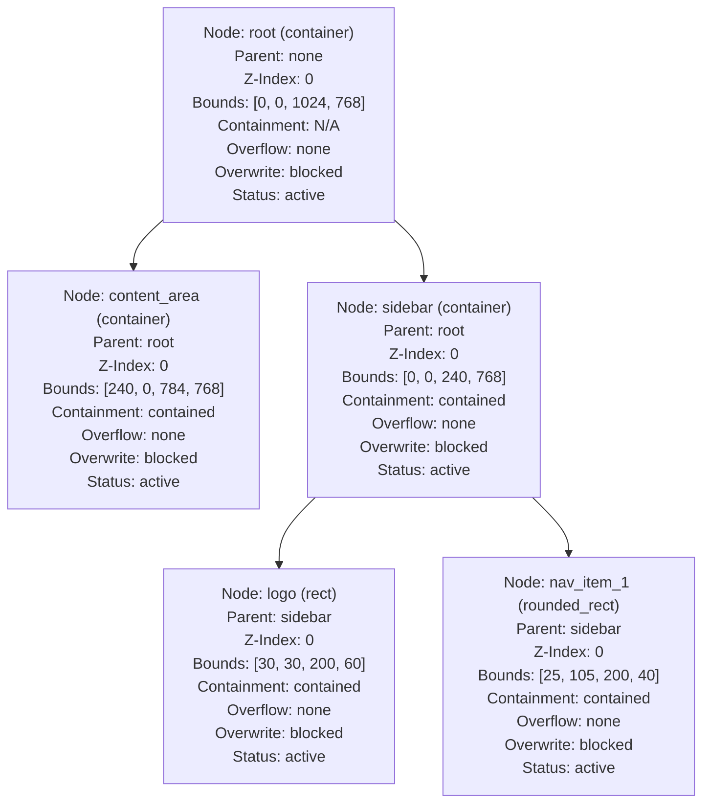

# Headless Scene Introspection & Mermaid Export Proof

**Status**: experimental · lab-only · no-canon · no-stable-schema · no-performance-claim
**Track**: `lab-native-gui-headless-scene-introspection-mermaid-export-v0`
**Category**: `gui`
**Design Layer**: Headless Scene Introspection Exporter (NGUI-P12)

This document describes the design, implementation, and verification of a headless scene introspection exporter that generates deterministic Mermaid diagrams and compact structural receipts representing the active scene trees, computed layout boxes, parenting hierarchies, slot-bound nodes, scoped slots, and boundary checks.

---

## 1. Introspection Model Design

The class `IgniterGui::SceneIntrospectionExporter` is responsible for evaluating the structural characteristics of active layouts without rendering graphics, running execution VM logic, or using browser capabilities. 

### 1.1 Containment & Overflow Checking
- **Parent/Child Containment**: For each node with a parent, the exporter compares the child node's computed layout box `[cx, cy, cw, ch]` against its parent's computed layout box `[px, py, pw, ph]`. If the child node is fully contained within the parent bounds, it is marked as `contained`. Otherwise, it is marked as `overflow`.
- **Overflow Allowance**: If a child node overflows its parent, the exporter reads the parent's `layout["overflow"]` property (e.g. `allow`, `clip`, or `none`) to determine whether this overflow is structurally permitted.
- **Structural Overwrite Allowance**: The exporter reads each node's `allow_structural_overwrites` flag to check if external state is allowed to resize or reposition it dynamically.

### 1.2 Slot-Bound Node & Scoped Slot Identification
- **Slot-Bound Nodes**: A node is marked as slot-bound if its `display_rules`, `interaction_intents` parameters, or text content `content` placeholders (e.g., `{slot:warnings_count}`) reference slots defined in the scene tree.
- **Scoped Slots**: If a referenced slot key contains a dot (e.g. `widget_1.tab`), it is identified as a scoped slot, mapping it to a local namespace and preventing global state pollution. The actual slot values are not exposed in the exported Mermaid graph or JSON receipt.

---

## 2. Deterministic Mermaid Exporter

To ensure diagnostic output can be verified in automated pipelines, the exporter produces a deterministic Mermaid flowchart representing the scene tree hierarchy:
1. **Sorted Node Definitions**: Nodes are sorted alphabetically by their unique ID before generating node descriptions.
2. **Sorted Hierarchy Edges**: Parent-child relationship arrows (`parent_id --> child_id`) are sorted alphabetically by parent ID, then child ID.
3. **Wording Formatting**: Labels include the node's computed bounds, z-index, parent, slot bindings, scoped slots, containment, overflow, overwrite rules, and primitive types.

Example generated Mermaid output structure:


---

## 3. Compact Introspection Receipt

The exporter outputs a value-free JSON structure summarizing the scene analysis:
- **`view_id` & `scene_digest`**: Tracked view identifiers and scene digests.
- **`node_count`**: Total nodes evaluated.
- **`nodes`**: A mapped dictionary of node metadata (excluding raw external inputs or runtime payloads).
- **`non_claims`**: Disclaimer metadata preserving compliance tags.

The receipt intentionally omits wall-clock timestamps so consecutive exports of
the same scene and layout remain byte-stable for proof comparison.

---

## 4. Verification Results

All 193 checks in the proof runner pass successfully:

```text
=== NGUI Proof Runner ===
Status: SUCCESS (ALL PASS)
Total: 193/193
```

### Exporter Verification Matrix

| Check ID | Description | Status |
| :--- | :--- | :--- |
| `NGUI-P12-1` | P11 and prior proof checks remain green | PASS |
| `NGUI-P12-2` | Valid scene exports Mermaid flowchart deterministically | PASS |
| `NGUI-P12-3` | Parent/child hierarchy is represented accurately in Mermaid output | PASS |
| `NGUI-P12-4` | Computed bounds are included in stable labels in Mermaid graph | PASS |
| `NGUI-P12-5` | Slot-bound nodes are marked in metadata without exposing raw SlotValues | PASS |
| `NGUI-P12-6` | Scoped slots are represented without global ambiguity in receipt | PASS |
| `NGUI-P12-7` | Boundary/overflow checks are represented in exporter receipt | PASS |
| `NGUI-P12-8` | Unsupported or malformed scene input fails closed with NGUI-P12-8 ValidationError | PASS |
| `NGUI-P12-9` | Duplicate node IDs or cyclic parents fail closed with NGUI-P12-9 ValidationError | PASS |
| `NGUI-P12-10`| Output Mermaid contains no absolute paths or local-file URI links | PASS |
| `NGUI-P12-11`| JSON receipt contains no absolute paths, local-file URI links, or raw external payloads | PASS |
| `NGUI-P12-12`| No DOM, GPU, windowing, or browser dependencies are introduced | PASS |
| `NGUI-P12-13`| No VM execution or contract dispatch occurs | PASS |
| `NGUI-P12-14`| Lab-only, no-canon, and no-stable-schema wording is preserved in exporter source | PASS |
