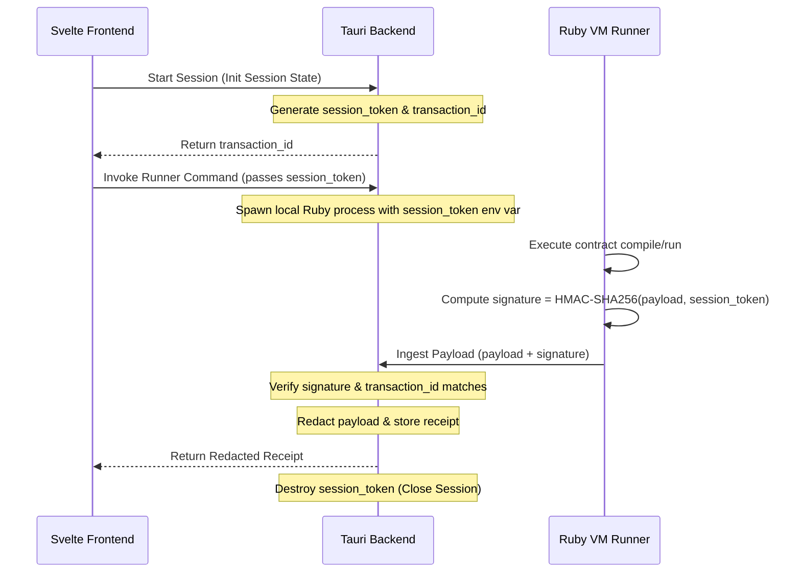

# Lab Design: Live Trace Bridge Session Boundary

Status: `experimental · lab-only · design`
Track: `lab-tauri-ivf-live-trace-bridge-design-and-session-boundary-v0`
Card: `LAB-TAURI-IVF-P19`
Category: `ide`
Base: `lab-docs/ide/lab-tauri-ivf-ruby-vm-telemetry-adapter-bridge-preflight-v0.md`

---

## 1. Context & Architectural Goal

This document defines the architectural design and security boundaries for connecting a local Ruby VM runner telemetry source to the Svelte/Tauri IDE telemetry ingress. 

The goal is to design a **bounded session manager** that secures the local communication channel between the runner process and the Tauri backend, ensuring strict isolation without opening network sockets, background listeners, or filesystem watchers.

---

## 2. Secure Session Boundary Design

### 2.1 Transient Session Manager Lifecycle
Rather than using a persistent background daemon, the telemetry bridge utilizes a demand-driven, transient session model:

### 2.2 Producer & Signature Validation Plan
1. **Dynamic Session Tokens**:
   - Upon session initiation, the Tauri Rust backend generates a transient cryptographically secure random token (`session_token`) and a `transaction_id`.
   - The `session_token` is passed to the spawned Ruby VM runner process via an environment variable (`IGNITER_TELEMETRY_TOKEN`). Any future temporary passport-file variant must stay bounded to a proof-local temp directory, be excluded from git, and be removed before the session closes.
2. **Signature Calculation**:
   - The Ruby VM runner computes a hash-based message authentication code (HMAC-SHA256) of the serialization payload using the `session_token` as the secret key.
   - The computed signature is sent in the `passport_signature` field of the envelope.
3. **Verification at Ingress**:
   - Tauri calculates the expected HMAC-SHA256 of the incoming payload using its active `session_token`.
   - If the signatures do not match, the payload is immediately rejected (fail-closed).
   - Once the payload is received and verified (or if a 5-second timeout expires), the `session_token` is cleared from memory.

### 2.3 Sourcing Transaction and Contract IDs
*   **`contract_id` validation**: The incoming `contract_id` must match a compiled contract artifact currently loaded in the IDE's active workspace view register.
*   **`transaction_id` tracking**: The `transaction_id` is generated by Tauri when spawning the runner task. The ingress engine rejects any payloads whose `transaction_id` does not match the active session.

---

## 3. Security Boundaries & Ingress Constraints

### 3.1 Redaction Before UI
All raw data—including variable dumps, warning texts, and compile outputs—is sanitized and redacted in the Rust Tauri backend *prior* to history storage or Svelte event emission. 
Only SHA-256 digests of outputs/diagnostics and keys of slot values are propagated to the frontend. This prevents cross-site scripting (XSS) or path/data leaks inside the webview rendering thread.

### 3.2 File System & Read Boundaries
*   **Allowed Directory Reads**: Tauri commands are restricted to reading within the workspace root folder. Any path argument must be canonicalized and checked via `path.canonicalize().starts_with(workspace_root)`.
*   **No local-file URI leaks**: Absolute paths and local-file URI schemes must be stripped from receipts before serialization.

### 3.3 No Network / Background Watcher Surface
To preserve lab-only safety, the bridge enforces the following prohibitions:
*   **Forbidden TCP/UDP ports**: No HTTP server, WebSocket host, or Unix domain socket listener is opened.
*   **Forbidden watchers**: No background folder polling threads or active filesystem watchers (`notify` crate / `fs.watch`) are allowed to run. Communication remains strictly synchronous and command-driven.

### 3.4 Fail-Closed Status Vocabulary
The adapter maps incoming statuses strictly:
*   Authorized vocabulary: `applied` (maps to `success`), `execution_failed`, `diagnostic_only`, `partial`.
*   Any other status (including `ingress_rejected` or unknown formats) triggers a fail-closed response, rejecting the payload and logging an attempted failure event in the history summary.

---

## 4. Next Step Recommendation (P20)

**Decision**: **Recommended, bounded proof only**.
Phase `LAB-TAURI-IVF-P20` may be dispatched as a **mock session runner proof**
to validate this secure session state manager, dynamic token exchange, timeout
cleanup, and HMAC signature validation loop under lab-only constraints.

This P19 design does not authorize live VM execution, external subscriptions,
background listeners, network ingress, public runtime support, stable schema,
canon status, or production authority.
