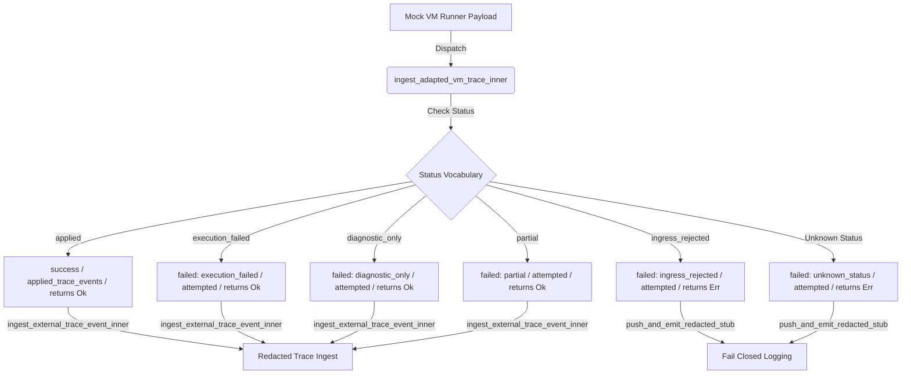

# Lab Proof: Mock VM Runner Trace Source & Adapter Hardening

Status: `experimental · lab-only · research`
Track: `lab-tauri-ivf-mock-vm-runner-trace-source-and-adapter-hardening-v0`
Card: LAB-TAURI-IVF-P16
Base: `lab-tauri-ivf-real-vm-trace-adapter-contract-and-status-vocabulary-v0.md`

---

## 1. Technical & Architectural Design

This phase implements a mock VM runner trace source and hardens status classification semantics within the Tauri IVF trace adapter:
1.  **Refactored Logging Helper (`push_and_emit_redacted_stub`)**:
    *   Introduced a private internal helper that encapsulates locking the circular telemetry buffer state, pushing a redacted/attempted stub, enforcing the capacity-10 bound, writing results to `out/telemetry_history_summary.json`, and emitting update events to Svelte.
    *   This reduces code duplication by ~100 lines and unifies the fail-closed paths.
2.  **Hardened Status Routing**:
    *   `applied` -> maps to `"success"` (applied event history, command returns `Ok`)
    *   `execution_failed`, `diagnostic_only`, `partial` -> map to `"failed: <reason>"` (verified non-applied trace, command returns `Ok` to reflect runner trace acceptance)
    *   `ingress_rejected` -> fails closed (returns `Err`, registers attempted stub in history)
    *   Unknown statuses -> fail closed (returns `Err`, registers attempted stub in history)
3.  **Mock VM Runner Ingress Source**:
    *   Exposed a test-local builder `build_mock_vm_runner_trace_payload` and command `run_mock_vm_runner_dispatch` to feed mock runner telemetry directly into the ingress pipe.
    *   All raw values are redacted (only keys and hashes are retained), with zero network listener or live VM runner requirements.

---

## 2. Ingress & Status Mappings Diagram

---

## 3. Verification Matrix

| Rule / Check | Requirement | Verification Status | Notes / Proof Evidence |
| :--- | :--- | :--- | :--- |
| **TIVF-P16-1** | Mock runner fixture accepted | `PASS` | `tx_p16_applied` returns `Ok`. |
| **TIVF-P16-2** | Applied trace maps to applied history | `PASS` | Registered with `event_type == "applied_trace_events"`. |
| **TIVF-P16-3** | `execution_failed` is verified non-applied | `PASS` | Returns `Ok` with `failed: execution_failed` status. |
| **TIVF-P16-4** | `diagnostic_only` is verified non-applied | `PASS` | Returns `Ok` with `failed: diagnostic_only` status. |
| **TIVF-P16-5** | `partial` is verified non-applied | `PASS` | Returns `Ok` with `failed: partial` status. |
| **TIVF-P16-6** | `ingress_rejected` classified as rejected ingress | `PASS` | Returns `Err`, registers attempted stub. |
| **TIVF-P16-7** | Unknown status fails closed | `PASS` | Returns `Err`, registers attempted unknown stub. |
| **TIVF-P16-8** | Invalid producer/signature fails closed | `PASS` | Fails closed with `Err`. |
| **TIVF-P16-9** | Raw outputs/diagnostics/slot values never persisted | `PASS` | Hashed and stripped. Only keys preserved. |
| **TIVF-P16-10**| FIFO history bounded at 10 | `PASS` | Checked via burst dispatch loop. |
| **TIVF-P16-11**| Event bridge emits timeline update | `PASS` | Emits `telemetry-history-updated` event. |
| **TIVF-P16-12**| No network/listener/watcher surface | `PASS` | Entirely in-memory and local file pipeline. |
| **TIVF-P16-13**| No `absolute-home-path/` or `local-file URI` leaks | `PASS` | Tested output summaries for absolute paths. |
| **TIVF-P16-14**| Lab-only posture preserved | `PASS` | Strictly local mock simulation. |
