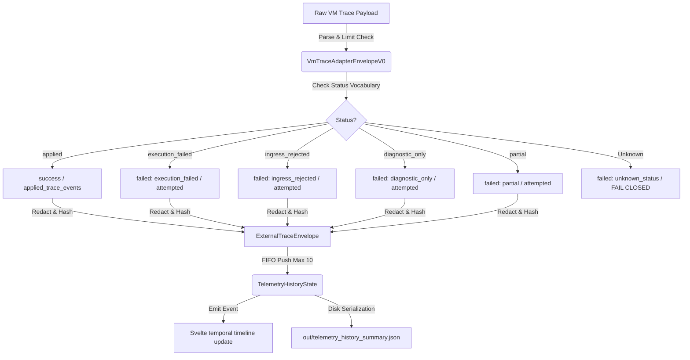

# Lab Proof: Real VM Trace Adapter Contract & Status Vocabulary

Status: `experimental · lab-only · research`
Track: `lab-tauri-ivf-real-vm-trace-adapter-contract-and-status-vocabulary-v0`
Card: LAB-TAURI-IVF-P15
Base: `lab-tauri-ivf-history-result-packet-and-viewer-hardening-v0.md`

---

## 1. Context & Architectural Design

This phase designs and implements a bounded real VM trace adapter contract for the Tauri IVF telemetry ingress:
1.  **Incoming Schema Representation (`VmTraceAdapterEnvelopeV0`)**:
    *   Defines the input contract layout of the real VM trace adapter payload, including `transaction_id`, `contract_name`, `status`, `timestamp`, `producer_id`, `target_views`, `outputs`, `diagnostics`, `slot_values`, and `passport_signature`.
2.  **Explicit Status Vocabulary mapping**:
    *   `applied` -> maps to `"success"` (registered as `applied_trace_events`)
    *   `execution_failed` -> maps to `"failed: execution_failed"` (registered as `attempted_trace_events`)
    *   `ingress_rejected` -> maps to `"failed: ingress_rejected"` (registered as `attempted_trace_events`)
    *   `diagnostic_only` -> maps to `"failed: diagnostic_only"` (registered as `attempted_trace_events`)
    *   `partial` -> maps to `"failed: partial"` (registered as `attempted_trace_events`)
    *   Unknown statuses fail closed immediately, returning a Tauri Error, and register an attempted event in history with status `"failed: unknown_status: <status>"`.
3.  **Redaction-by-Default Preservation**:
    *   Slot values are stripped of their raw values (only their keys are retained).
    *   Outputs and diagnostics are hashed using SHA-256 to prevent leakage.
4.  **Security & Limits Validation**:
    *   Payload size limit is strictly checked (< 64KB).
    *   Passport signature and producer ID constraints are verified.
    *   No network ports are opened, and zero absolute local paths or `local-file URI` protocols are leaked.
5.  **FIFO Ingress Buffer & UI Updates**:
    *   Redacted receipts are pushed into the bounded telemetry history buffer (capacity = 10).
    *   Disk serialization (`out/telemetry_history_summary.json`) and Svelte event bridge updates (`telemetry-history-updated`) occur outside the mutex lock to prevent deadlocks.

---

## 2. Ingress Mappings Diagram

---

## 3. Verification Matrix

| Rule / Check | Requirement | Verification Status | Notes / Proof Evidence |
| :--- | :--- | :--- | :--- |
| **TIVF-P15-1** | Adapter schema fixture acceptance | `PASS` | Envelope deserializes correctly in tests. |
| **TIVF-P15-2** | Status: `applied` mapping | `PASS` | Mapped to `success` and `applied_trace_events`. |
| **TIVF-P15-3** | Status: `execution_failed` mapping | `PASS` | Mapped to `failed: execution_failed`. |
| **TIVF-P15-4** | Status: `ingress_rejected` mapping | `PASS` | Mapped to `failed: ingress_rejected`. |
| **TIVF-P15-5** | Status: `diagnostic_only` mapping | `PASS` | Mapped to `failed: diagnostic_only`. |
| **TIVF-P15-6** | Status: `partial` mapping | `PASS` | Mapped to `failed: partial`. |
| **TIVF-P15-7** | Unknown status fails closed | `PASS` | Unknown vocabulary throws Tauri Error, registers attempted. |
| **TIVF-P15-8** | Immediate SHA-256 redaction | `PASS` | Digests computed and raw payloads dropped. |
| **TIVF-P15-9** | Raw slot value drop (keys only) | `PASS` | Slot values converted to key list only. |
| **TIVF-P15-10**| Invalid signature/producer rejection | `PASS` | Mismatched signature fails closed. |
| **TIVF-P15-11**| FIFO capacity-10 eviction | `PASS` | Evicts oldest elements, maintaining latest 10. |
| **TIVF-P15-12**| UI event bridge updates | `PASS` | Emits Tauri updates for Svelte components. |
| **TIVF-P15-13**| Zero absolute local path leaks | `PASS` | Tested against `Users` and `local-file URI` references. |
| **TIVF-P15-14**| Lab-only posture | `PASS` | Verified with no-live-service / no-network posture. |
