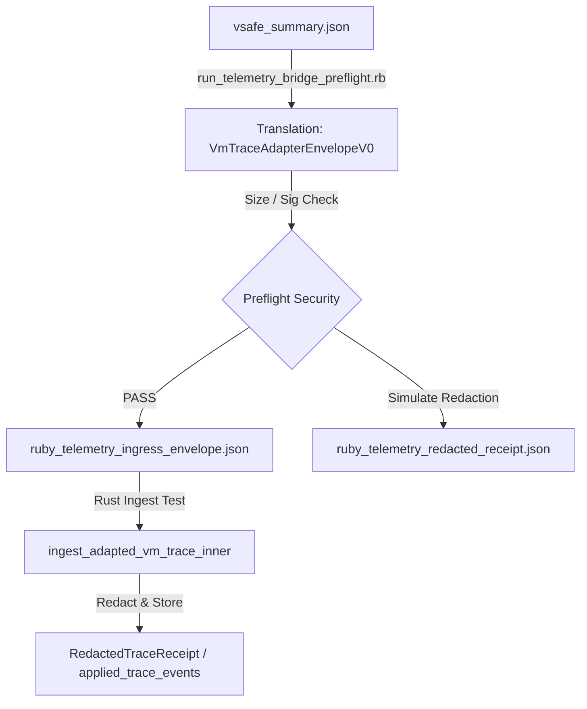

# Lab Proof: Ruby VM Telemetry Adapter Bridge Preflight

Status: `experimental · lab-only · research`
Track: `lab-tauri-ivf-ruby-vm-telemetry-adapter-bridge-preflight-v0`
Card: `LAB-TAURI-IVF-P18`
Category: `ide`
Base: `lab-docs/ide/lab-tauri-ivf-telemetry-status-control-dashboard-v0.md`

---

## 1. Technical & Architectural Design

This phase designs and implements a preflight translation bridge for Ruby VM runner result telemetry:
1. **VM Runner Output Translation**:
   - Parses the controlled VM runner result packet `out/vsafe_summary.json` containing compilation status, rule execution outcomes, and sanitization warnings.
   - Maps runner properties to the Tauri `VmTraceAdapterEnvelopeV0` schema:
     - `overall_status` ("SUCCESS") -> `status` ("applied")
     - Converts the timezone-annotated timestamp into strict ISO 8601 (`YYYY-MM-DDTHH:MM:SS+HH:MM`).
     - Injects `producer_id` `"ruby-vm-runner-v1.0"` and mock `passport_signature` `"valid-mock-signature"`.
     - Maps `results` to `outputs` and `warnings` to `diagnostics.warnings`.
2. **Local Preflight Security Enforcement**:
   - Validates that the payload is fail-closed with respect to size limits (<= 65536 bytes) and valid signature/producer requirements.
   - Simulates the Tauri back-end redaction pipeline locally in Ruby to ensure zero raw warnings or results leak into final redacted stubs, and that no local absolute paths or local-file URI markers exist in the output receipt.
3. **Tauri Integration Alignment**:
   - Added a Rust unit test `test_ruby_vm_telemetry_preflight_envelope` that reads the generated `ruby_telemetry_ingress_envelope.json` and parses it via `ingest_adapted_vm_trace_inner`, confirming full integration alignment.

---

## 2. Ingress & Status Mappings Diagram

---

## 3. Verification Matrix

| Rule / Check | Requirement | Verification Status | Notes / Proof Evidence |
| :--- | :--- | :--- | :--- |
| **TIVF-P18-1** | Translated envelope size is bounded under 65536 bytes | `PASS` | Preflight size: 1465 bytes. |
| **TIVF-P18-2** | Injected producer matches authorized list | `PASS` | Producer is set to `'ruby-vm-runner-v1.0'`. |
| **TIVF-P18-3** | Injected signature matches authorized signature | `PASS` | Signature is set to `'valid-mock-signature'`. |
| **TIVF-P18-4** | Redacted receipt contains zero raw outputs or warnings | `PASS` | Verified that raw rule results and warning strings are absent from the redacted stub. |
| **TIVF-P18-5** | Redacted receipt leaks no absolute local paths | `PASS` | Verified that local home path and local-file URI markers are absent from the receipt. |
| **TIVF-P18-6** | Backend Rust test ingests the translated payload successfully | `PASS` | Cargo unit test `test_ruby_vm_telemetry_preflight_envelope` executes and passes cleanly. |
| **TIVF-P18-7** | Bounded local-only isolation is preserved | `PASS` | No network listeners, background daemon watchers, or port bindings were added. |

---

## 4. Conclusion & Next Steps

The preflight bridge translation matches the schema and safety requirements of the Tauri backend. The generated mock envelopes parse cleanly into the Svelte-reacting timeline buffer. 

As recommended by the mapping register:
- Future work may design a bounded live-trace bridge preflight that reuses the
  mapped schema proven in this track. This P18 proof does not authorize live VM
  execution, external subscriptions, background listeners, public runtime
  support, stable schema, or canon status.
