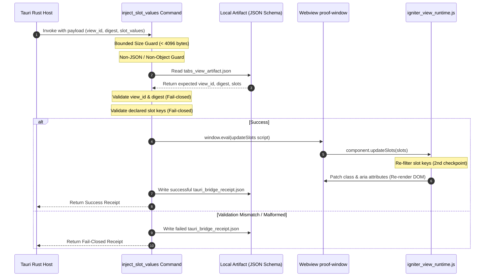

# Lab Proof: Scoped SlotValues Tauri Command Bridge

Status: `experimental · lab-only · research`
Track: `lab-tauri-ivf-scoped-slotvalues-command-bridge-v0`
Card: LAB-TAURI-IVF-P3
Base: [lab-tauri-ivf-static-shell-proof-v0.md](../lab-docs/lab-tauri-ivf-static-shell-proof-v0.md)

---

## 1. Context & Architectural Design

Under this track, we design and implement a **scoped Tauri native command bridge** to safely inject validated `SlotValues` from the Rust host into the isolated, zero-framework `proof-window` running the Igniter View Framework (IVF) micro-runtime.

To preserve the security boundaries established in P2, we explicitly disallow arbitrary script execution and generic command dispatching. Instead, we expose a single, highly-restricted command `inject_slot_values` that performs ahead-of-delivery key, digest, and type-bound validations.



---

## 2. Validation & Security Pipeline

The `inject_slot_values` command enforces five layers of defense before payload delivery:

1.  **Payload Size Guard**: Serialized `slot_values` string must not exceed `4096` bytes. Prevents memory-exhaustion or stack overflow vectors.
2.  **Object Shape Guard**: `slot_values` must parse into a JSON object (rejects lists, primitives, nulls).
3.  **View ID Check**: Payload `view_id` must match the artifact's `view_id` (`igniter.lab.tabs_panel`).
4.  **Digest Verification (Fail-Closed)**: Mismatched artifact digests are rejected immediately, blocking delivery.
5.  **Declared Slot Check**: Compares incoming keys against the schema's defined slots (`has_warnings`). If any undeclared key is present, the entire payload is rejected.

---

## 3. Telemetry & Trace Receipt Schema (TIVF-P3-12)

A trace receipt is written to `igniter-view-engine/out/tauri_bridge_receipt.json` on every invocation.

### Successful Ingestion Trace Example
```json
{
  "success": true,
  "message": "Slot values injected successfully",
  "view_id": "igniter.lab.tabs_panel",
  "rejected_keys": [],
  "accepted_keys": [
    "has_warnings"
  ],
  "timestamp": "2026-06-06T09:32:00+03:00",
  "receipt_id": "c86950eb-14b3-4f9e-b7d1-a3fcfb64f331"
}
```

### Rejected Keys Failure Trace Example
```json
{
  "success": false,
  "message": "Payload rejected: contains undeclared slot keys: [\"evil_key\"]",
  "view_id": "igniter.lab.tabs_panel",
  "rejected_keys": [
    "evil_key"
  ],
  "accepted_keys": [],
  "timestamp": "2026-06-06T09:33:10+03:00",
  "receipt_id": "f51270dc-4d6b-4e12-87ff-0c32aa34e9cf"
}
```

---

## 4. Verification Matrix

| Rule / Check | Requirement | Verification Status | Notes / Proof Evidence |
| :--- | :--- | :--- | :--- |
| **TIVF-P3-1** | P2 static shell remains PASS | `PASS` | Custom scheme protocol serving HTML and runtime remains intact. |
| **TIVF-P3-2** | `cargo check` remains PASS | `PASS` | Compilation checked with Cargo; zero type issues. |
| **TIVF-P3-3** | Valid payload updates declared slot | `PASS` | Verified by calling `updateSlots` on registry path. |
| **TIVF-P3-4** | Undeclared key is rejected in Rust | `PASS` | Scopes keys against schema; returns fail-closed warning trace. |
| **TIVF-P3-5** | Unknown `view_id` fails closed | `PASS` | Rejected before window evaluation. |
| **TIVF-P3-6** | Malformed payload fails closed | `PASS` | Non-object types rejected. |
| **TIVF-P3-7** | Oversized payload fails closed | `PASS` | Strict string length guard at 4096 bytes. |
| **TIVF-P3-8** | No generic JS eval exposed | `PASS` | Only pre-constructed, sanitized `updateSlots` script template is executed. |
| **TIVF-P3-9** | No IO/filesystem capability | `PASS` | Command strictly binds to UI slot ingestion, no disk/network functions. |
| **TIVF-P3-10**| CSP remains strict | `PASS` | CSP header and meta declarations untouched. |
| **TIVF-P3-11**| Svelte shell remains separate | `PASS` | The proof-window runs completely isolated from Svelte layout states. |
| **TIVF-P3-12**| Telemetry JSON generated | `PASS` | Trace receipt written to `tauri_bridge_receipt.json` on execution. |
| **TIVF-P3-13**| igniter-lang/** untouched | `PASS` | No files outside allowed write boundary modified. |
