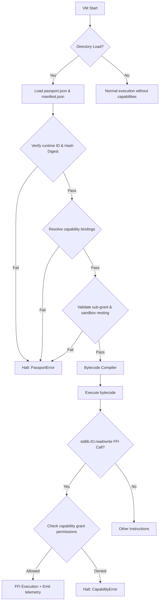

# Design Specification: VM Loader Capability Passport Integration (v0)

**Card**: `LAB-STDLIB-IO-P8`
**Track**: `lab-experimental-io-vm-loader-capability-passport-integration-v0`
**Route**: `EXPERIMENTAL / LAB-ONLY`
**Status**: `completed`

---

## 1. Design Overview

To establish a secure, contract-native execution environment, we integrate the generalized capability passport schema with the `igniter-vm` loader/execution boundary. The VM loader consumes the compiler-emitted `passport.json` and `manifest.json` directly to resolve capability bindings, dynamically verifying that all delegated capabilities conform to strict sandboxing and escalation policies before contract execution begins.

Key features implemented:
1. **Direct Passport & Manifest Verification**: The VM loader checks integrity by validating that `artifact_digest` matches the manifest's `artifact_hash` (tampering detection), and that `runtime_implementation_id` targets the delegated I/O runtime.
2. **Explicit Dependency Mapping**: Dynamic capability bindings map contract parameters (e.g. `io_first_read`, `io_second_read`) directly to parent active grants without relying on legacy `io_child` shims.
3. **Sub-Grant Validation**: For every capability parameter, the loader checks that the callee's requested grant is a strict sub-grant of the caller's active grant. It verifies:
   - Resource types match.
   - Permissions are not escalated (e.g., read-only parent cannot delegate write access).
   - Callee's sandbox directory is a subdirectory of (or equal to) the parent's sandbox directory. Paths are cleaned lexically and resolved to absolute paths before comparison to prevent directory traversal escapes.
   - Allowed absolute paths are a strict subset of the parent's allowed absolute paths.
4. **Fail-Closed Execution**: Malformed, missing, tampered, or mismatched passports, missing bindings, or missing active grants immediately halt contract loading, failing closed.
5. **Observability Integration**: FFI-based standard library read/write calls capture and register observations (`io_read_observation`) and receipts (`io_write_receipt`) directly inside the VM's observation sink.

---

## 2. Capability Resolution & Execution Flow

---

## 3. Verification Outcomes

The validation runner (`proofs/io_vm_loader_capability_passport_integration.rb`) successfully executed all 17 matrix checks:

* **IOVM-1 to IOVM-3 (Multi-Capability VM Resolution)**: Proves that the VM loader successfully reads compiler-emitted P7 passports, processes bindings without alias collisions, and allows execution of multiple distinct read operations.
* **IOVM-4 to IOVM-10 (Integrity and Loader Gaps)**:
  - **IOVM-4 (Tampering)**: Modifying `artifact_digest` triggers immediate tamper detection and fails closed.
  - **IOVM-5 (Runtime Incompatibility)**: Mismatched runtime IDs fail closed.
  - **IOVM-6 (Missing Passport)**: Runs without `passport.json` fail closed when loading from a directory.
  - **IOVM-7 (Malformed JSON)**: Invalid JSON in `passport.json` fails closed.
  - **IOVM-8 (Missing Bindings)**: Deleting `capability_bindings` fails closed.
  - **IOVM-9 (Missing Required Capability)**: Mismatch in required capabilities list fails closed.
  - **IOVM-10 (Missing Active Grant)**: Lack of a parent-provided active grant fails closed.
* **IOVM-11 & IOVM-12 (Escalation & Escape Boundaries)**:
  - **IOVM-11 (Escalation)**: Delegating write permission from a read-only parent grant fails closed.
  - **IOVM-12 (Sandbox Escape)**: Attempting to target a sandbox outside the parent's sandbox boundary (using absolute path injection in `passport.json`) fails closed.
* **IOVM-13 (Ambient Block)**: Attempting to reference caller capabilities directly (ambient access) instead of declared parameters fails closed with `AmbientAccessViolation`.
* **IOVM-14 & IOVM-15 (Observability & Telemetry)**: Successful execution produces `io_read_observation` and `io_write_receipt` logs recorded in the output directory.
* **IOVM-16 & IOVM-17 (Hygiene & Closed-Surface)**: Verified that compiler-side label duplicate diagnostics do not block execution, and validated that the mainline repository and forbidden boundaries are untouched.
