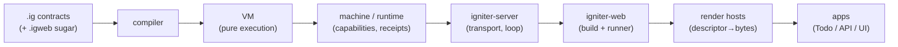
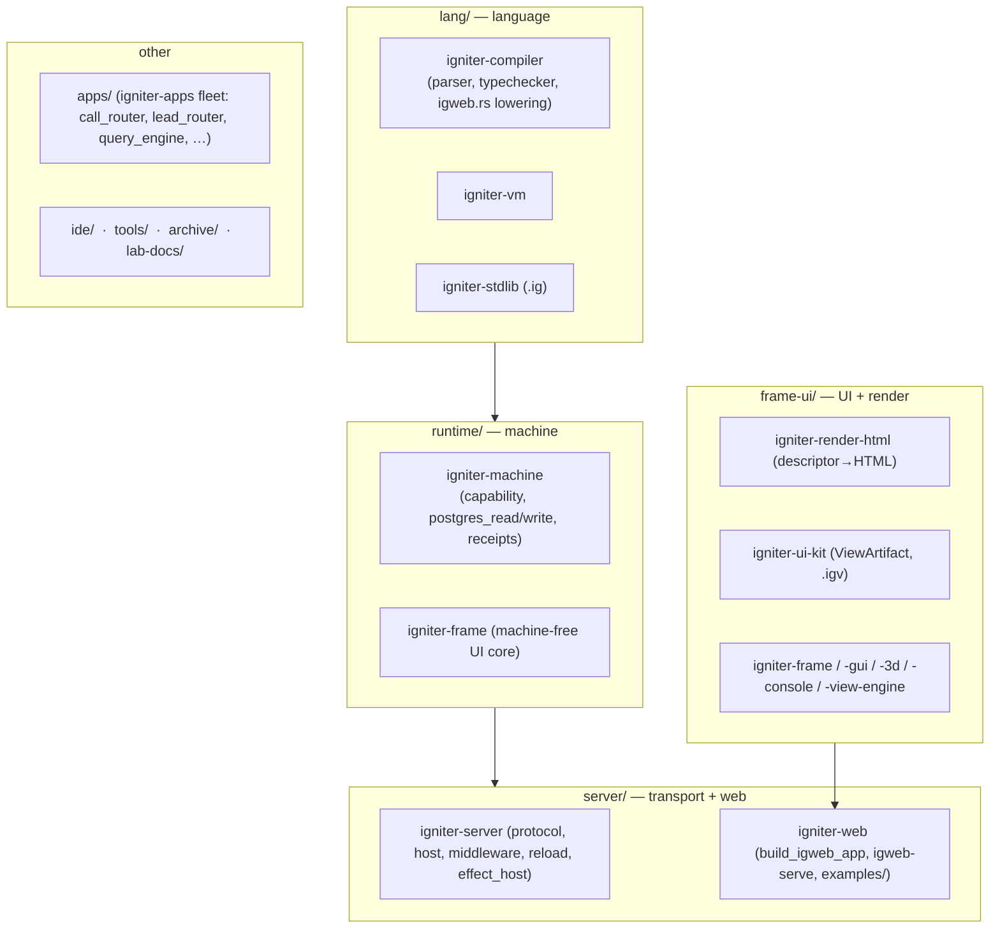
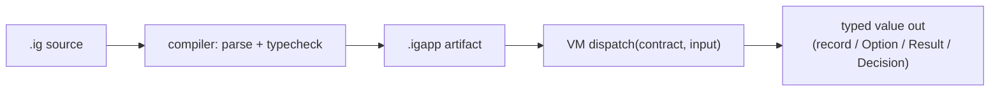
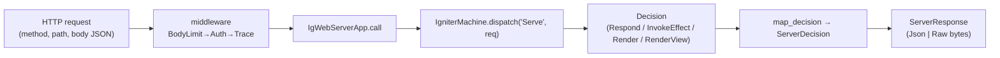
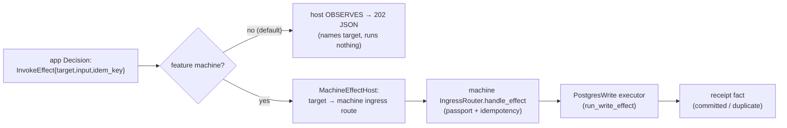
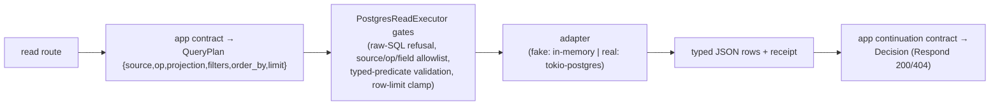
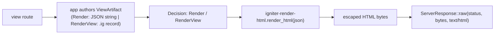
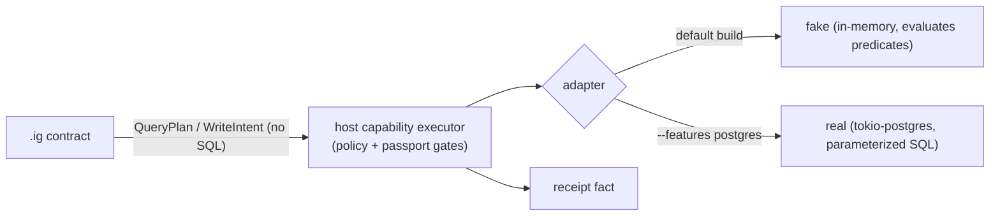

# lab-igniter-ecosystem-map-p1-v0 — the Igniter lab ecosystem, as it exists today

**Card:** `LAB-IGNITER-ECOSYSTEM-MAP-P1` · **Delegation:** `OPUS-IGNITER-ECOSYSTEM-MAP-P1`
**Status:** EXPLANATION / ARCHITECTURE MAP (v0) — a durable, navigable map of the current lab state.
**No code/test/fixture/Cargo/canon change. No new decisions. This maps evidence, not a mandate.**
All surfaces below are **lab evidence**, never canon (see §9).

> **Verified live** against the working tree on 2026-06-20 (see §11 for the surface list). Where a count
> is quoted from a proof doc rather than re-run here, it is labelled *(from proof doc)*. Postgres read
> counts in §7 were re-run in the P10/P11 work.

---

## 1. One-page mental model

```text
Igniter language (.ig) describes CONTRACTS — pure, validated dataflow + logical intent.
Compiler + VM execute that pure graph. They never do IO.
Machine (runtime) owns CAPABILITY execution: receipts, idempotency, reconcile, external effects.
Server owns TRANSPORT: a socket, a bounded loop, concurrency, middleware, response framing.
IgWeb projects web AUTHORING (.igweb) into ordinary .ig `Serve(Request)->Decision` contracts.
Render/export hosts turn structured DESCRIPTORS (ViewArtifact JSON) into bytes (HTML).
Apps own DOMAIN meaning (Todo, accounts, …). The host owns DB schema/policy/DSN/effect identity.
```

The spine, read left to right — **authoring on the left, host authority on the right**:



---

## 2. Domain map of the repo

Top-level directories (live tree):



- **Language** (`lang/`): the compiler (parser, typechecker, `.igweb` lowering in `igweb.rs`), the VM, and
  the stdlib written in `.ig`.
- **Runtime** (`runtime/`): `igniter-machine` (the capability/effect host, Postgres adapters, receipts);
  `igniter-frame` is the machine-free interactive-frame core.
- **Server/web** (`server/`): `igniter-server` (generic transport — no app knowledge) and `igniter-web`
  (the IgWeb build + `igweb-serve` runner + example apps).
- **Frame/UI** (`frame-ui/`): `igniter-render-html` (the descriptor→HTML host), `igniter-ui-kit`
  (ViewArtifact + `.igv`), plus the frame/gui/3d/console exploration crates.
- **Apps** (`apps/igniter-apps/`): the proving-ground `.ig` fleet (`call_router`, `lead_router`,
  `query_engine`, `batch_importer`, …). **IDE/tools/archive/lab-docs** hold tooling and documentation.

---

## 3. Dependency / authority map — who owns what

The whole system is a discipline about **where authority may live**. The arrows in §1 only ever carry
*data*; they never carry *authority backwards*.

| Layer | Owns | Must **not** own |
|---|---|---|
| `.ig` / app contracts | product meaning, logical intent, structured `QueryPlan`/`WriteIntent`, `Decision` outcome | SQL, a DB handle, capability identity, secrets, a socket |
| compiler + VM | pure typecheck + execution of the contract graph | any IO, effects, network, persistence |
| machine (`igniter-machine`) | capability execution, passport/allowlist gates, receipts, idempotency, reconcile, the DB connection | product routing, HTTP framing, app domain meaning |
| server (`igniter-server`) | transport, bounded loop, concurrency, middleware, response framing (incl. raw bytes) | a route table, app/domain knowledge, effect identity |
| IgWeb (`igniter-web`) | lowering `.igweb`→`.ig`, building the app capsule, the runner, middleware composition | server-side routing authority, DB policy |
| render hosts (`igniter-render-html`) | descriptor→bytes (ViewArtifact JSON → escaped HTML), fail-closed safety | domain logic, IO, templating-as-authority |
| operator / host config | DB schema, read/write policy + allowlists, DSN, logical-target→effect bindings, passports | being authored in `.ig` or in the manifest |

**Load-bearing consequence:** the server doesn't know about SparkCRM/Todo because *routing is the compiled
`Serve` contract*, and *effect identity is a host-signed recipe + passport* — neither is visible to the
transport (§5, §6).

---

## 4. Main execution paths

### 4.1 Pure `.ig` contract execution



A contract is pure: `input → compute (incl. call_contract, match, map/filter) → output`. No IO. `Option`
and `Result` are built-in sealed sums (`some/none`, `ok/err`); records are bare `{ field: value }`
literals; relations/queries are just contracts returning structured values.

### 4.2 IgWeb request → generated `Serve` → `Decision`



The compiled `Serve` contract **is** the route table: a nested `if matches(path,re) { if method==… } else …`
tree ending in `Respond 404`. `igniter-server` never inspects `(method, path)`
(`server/igniter-server/src/host.rs`). `IgWebServerApp::call` dispatches the entry contract and
`map_decision` (`server/igniter-web/src/lib.rs`) turns the `Decision` into a `ServerResponse`.

### 4.3 Write effect path



The app decides a **logical** `target` only. Effect **identity** (capability, scope, DSN) is a host-signed
recipe + passport — never in the app decision or the manifest. Default build observes (202); the
`--features machine` harness executes through the proven machine ingress + receipt path
(`server/igniter-server/src/effect_host.rs`). Idempotency is two-layer (machine receipt + PG
`effect_receipts`); unknown writes reconcile read-only.

### 4.4 Read host path



The contract emits a **structured `QueryPlan`** — never SQL, never a connection. The host owns every gate
(allowlists, predicate validation, clamp) and the connection; rows return as typed JSON and an app
continuation shapes the `Decision`. Proven over the `read-guard-host` seam *(from proof doc P6)*.

### 4.5 Render HTML path



`igniter-render-html` is a **pure descriptor→bytes** function: ViewArtifact JSON → escaped HTML, fail-closed
on unknown nodes / unsafe URLs / bad JSON, no domain logic. The HTML is framed by the **host** over the
raw-bytes response seam — the app only describes the view.

---

## 5. IgWeb explained

`.igweb` is a **Projection Dialect** (`lab-igniter-projection-dialects-p0-v0.md`): authored sugar that
lowers **deterministically** to ordinary, inspectable `.ig`, creating **no hidden runtime authority**. The
generated `.ig` `Serve(Request) -> Decision` contract is the behavioral truth.

Route-authoring sugar (all lower to the **same flat** `.ig` route tree — `lang/igniter-compiler/src/igweb.rs`):

| Sugar | Meaning | Lowers to |
|---|---|---|
| `route M "pat" -> C` | one route | `if matches(path,re){ if method==M {call_contract("C",…)} }` |
| `scope "/p/:x" { … }` | path-prefix composition (P16) | prefix concatenated onto each inner route (byte-identical to flat) |
| `resource todos "/todos" { index GET -> … }` | REST validator/expander (P17) | one flat `route` per action; closed action table, **explicit contract names** |
| nested resources (P18) | `scope` **wraps** `resource` — no new keyword | composed prefix + base + suffix |
| `route … via Guard(args) as ctx -> H` (P20) | route-level guard/context (single) | `match call_contract("Guard",…){ Ok{value}=>H Err{error}=>error }` |

Param binding is **positional** (`capture(path,re,i)`); names are author-facing. `via` returns the built-in
`Result[Ctx, Decision]` (guard-owned failure mapping). Multi-`via` chaining and scope-level `via` are
**deferred** (the `Result` `value`-shadowing wall — see `…-via-chain-readiness` / context-composition P25);
multi-step loading uses a single composite-context guard. Context `let`/`guard` accumulation is **readiness**
*(from proof doc P25)*, not shipped.

The runner (`igweb-serve`, `lab-igniter-web-runner-p12-v0.md`):

- `igweb-serve check <dir>` (dry build, no socket) · `igweb-serve run <dir>` (bounded loopback serve).
- `igweb.toml`: `[app] entry/sources`, `[server] mode=loopback/max_requests`, `[middleware]
  trace/body_limit_bytes/auth_token_env`. The manifest **cannot** name routes, secrets, bind addresses, or
  effect identity.
- Middleware (`BodyLimit → Auth → Trace → app`) is composed host-side, never inside the app.

**`igniter-server` still has no route table.** Routing is the compiled capsule; the host calls
`ServerApp::call` and frames the response.

---

## 6. TodoApp as the stitched example

The Todo family is the running narrative (`server/igniter-web/examples/`):

| App | Shows |
|---|---|
| `todo_app` | the baseline — flat `.igweb` routes + `handlers.ig`, plain `Respond`. |
| `todo_v2_app` | account-scoped routing — `scope` + `resource` + nested + `via` over real path params. |
| `todo_postgres_app` | Postgres-shaped API — read intent (`QueryPlan`), write intent (`InvokeEffect`), observed vs machine-executed effects, host policy. P4 write work is committed as a separate harvest slice. |
| `todo_view_app` | views — `RenderView` over `.ig`-authored ViewArtifact, list authoring via `map`, conditional lists via `filter`+`map`. P22 conditional-list work is committed as a separate harvest slice. |
| `ctx_demo_app`, `ctx_accum_demo_app` | request-context composition proofs (`let`/`guard`, accumulation). |
| `render_html_app` | `Render` decision → ViewArtifact JSON → HTML bytes. |

**Current done / not-yet** (as of this harvest):

| Capability | State |
|---|---|
| Routing sugar: scope / resource / nested / single `via` | ✅ implemented + compile-proven |
| Read host seam (QueryPlan → policy-gated executor → rows → continuation) | ✅ proof *(P6 / api-read P3)* |
| Write effect host (`InvokeEffect` → machine → receipt, `--features machine`) | ✅ proof *(P4)* |
| Typed reads + predicates (`in`/range/`order_by`) on the machine | ✅ implemented (P10/P11) |
| ViewArtifact render (`Render`/`RenderView`) + list/conditional authoring | ✅ proof (P16/P19/P21/P22) |
| Todo API **write** shape, write effect host, read host seam | ✅ proof (P4/P6) |
| Todo API read-write e2e, multi-`via`/scope-context, live Postgres e2e | ⏳ deferred (§10) |

---

## 7. Data / Postgres model

- **Schema is operator/app-owned**, never in the VM. The machine has no schema object; the host publishes a
  `PostgresReadPolicy` (allowed sources/fields, per-field decode **kind**, row cap).
- **`.ig` contracts emit structured intents**: `QueryPlan { source, op, projection, filters:[{field,op,value/values}], order_by, limit }`
  for reads; `WriteIntent { operation, target, key, values, correlation_id }` for writes. **No raw SQL in
  `.ig`** — `sql`/`raw_sql`/`query` keys are structurally refused.
- **Read host** (`runtime/igniter-machine/src/postgres_read.rs`): raw-SQL refusal → source/op/field
  allowlist → typed-predicate validation (P11: `eq`/`in`/`gt`/`gte`/`lt`/`lte` per field kind) → row-limit
  clamp → adapter. **Typed reads** (P10): `Integer`/`Boolean`/`Json`/`Array`/lossless `Timestamp`+`Decimal`
  strings. (Re-run in P10/P11: 18 read tests + 6 bridge tests green; real-DB tests skip without
  `IGNITER_PG_DSN`.)
- **Write host** (`postgres_write.rs`): `run_write_effect` two-phase receipt; two-layer idempotency (machine
  receipt + PG `effect_receipts`); read-only reconcile for unknown writes.



**Fake vs live:** the **fake** adapter (default build, pure Rust) is the always-on behavioral contract and
now **evaluates** predicates/order; the **real** `tokio-postgres` adapter is opt-in (`--features postgres`),
local-only, read-only, and gated/skipped without a DSN. **Gaps:** live-PG end-to-end in the web path,
structured (non-string) effect *input*, and a staged read runner are not yet landed.

---

## 8. UI / rendering model

- **JSON-first ViewArtifact**: a closed-vocabulary view/form descriptor (`igniter-ui-kit/src/view_artifact.rs`;
  nodes: label/text/checkbox/button/select; layouts form/workbench). `.igv` is a Projection Dialect that
  lowers to that JSON.
- **Raw response seam**: `ServerResponse` carries either `Json(Value)` or `Raw { bytes, content_type }` —
  so HTML/CSV/PDF can ship verbatim (this is *how HTML gets sent through a once-JSON server*).
- **`igniter-render-html`**: pure ViewArtifact-JSON → escaped HTML; fail-closed; `igniter-server`
  dependency-free *(render-html P3)*.
- **`Render` vs `RenderView`**: `Render { artifact_json }` carries a ViewArtifact **JSON string** (e.g. from
  `req.body`); `RenderView { view: ViewArtifact }` carries a **typed `.ig` record** the VM serializes. Both
  converge on `render_html` → raw `text/html` bytes; the **host** frames the HTML, the **app** only
  describes it.
- **App-local helpers + lists**: helper contracts build `HtmlNode`/`ViewArtifact` records (P20); lists via
  `map(coll, x -> call_contract("…", x))` (P21); conditional lists via `filter` then `map` (P22) — **no new
  syntax**. (`.ig.html` is **not** a decision here — only a possible future alternative.)

---

## 9. What is lab evidence vs canon

Everything in this map is **lab**. Status vocabulary used across the docs:

| Status | Meaning | Examples |
|---|---|---|
| **readiness / design** | a packet that decides shape, no code | projection-dialects P0, via-readiness P19, context-composition P25, relational-contracts P1 |
| **lab implementation proof** | code + green tests, lab-only | igweb scope/resource/nested/via P16–P20, postgres typed/predicates P10/P11, render-html P3, read-guard-host P6, effect-host-write P4 |
| **app example** | a fixture demonstrating a stitched flow | the `examples/` Todo family |
| **canon / public contract** | part of the public Igniter language | requires an explicit `LANG-*` canon gate — **none of the above is canon** |

**This document maps the lab state and promotes nothing to canon.** `.igweb`, `.igv`, ViewArtifact, the
Postgres capabilities, and the render host are all proven-in-lab and lab-only. Promotion is a separate,
deliberate gate.

---

## 10. Current frontier / next moves

Grounded in the live tree (short, not a roadmap):

- **Todo API read-write e2e** — P4 extends the write seam into the product Todo path; the next product step
  is read+write in one fake-host e2e.
- **ViewArtifact select options** — P22 proves conditional lists; select-options authoring is the next view
  slice.
- **Context composition** — ship `let` + single `guard` (P25 readiness); multi-level accumulation waits on
  the `Result` `value`-shadowing wall (also blocks multi-`via`).
- **Postgres** — `KEYSET-P12` (stable cursors) or live-PG e2e in the web path; structured effect *input*
  (today `InvokeEffect.input` is a string).
- **Render/export family** — more descriptor→bytes hosts beyond HTML.
- **Package / workspace resolver** — a separate lane (the repo has no Cargo workspace root; crates use
  `../` path-deps).

---

## 11. Verified live surfaces (this card)

`git status --short` + `git diff --check` run before writing (docs-only card; P4/P22 were separate
same-harvest slices). Read to ground the map: `lang/igniter-compiler/src/igweb.rs`; `runtime/igniter-machine/src/postgres_{read,write,real}.rs`
+ `capability.rs`; `server/igniter-server/src/{protocol,host,middleware,reload,serving_loop,effect_host}.rs`;
`server/igniter-web/src/lib.rs` + `bin/igweb-serve.rs`; `frame-ui/igniter-render-html/src/lib.rs`;
`server/igniter-web/examples/` (7 apps); and the proof docs in §1's verify list.

**Same-harvest implementation slices (not part of this docs-only card):** P4 (`todoapp-api-write`) and P22
(`viewartifact-conditional-lists`) are committed separately. This map treats their proof docs as current lab
evidence while keeping their diffs out of the map commit.

---

*Lab explanation/architecture map. Compiled 2026-06-20 from the live tree + the latest proof per lane. No
code, test, fixture, Cargo, or canon change. Maps current evidence; promotes nothing to canon.*
