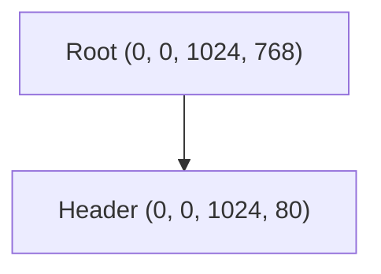

# View / GUI / IDE First Proof

Status: active

Goal:
Trace view and GUI engine receipts, inspect safe preview/introspection structures, and understand how the Tauri IDE shell integrates these without executing active code.

This lesson explores the current frontend layout, scene trees, and IDE
visualization components in `igniter-view-engine/`, `igniter-gui-engine/`, and
`igniter-ide/`.

## Read

Start with these files:

| File | Why It Matters |
| --- | --- |
| [View engine README](../../frame-ui/igniter-view-engine/README.md) | DSL parser, SSR renderer, and static view tree representation. |
| [GUI engine README](../../igniter-gui-engine/README.md) | Headless layout solver, scene tree validation, and Mermaid introspection export. |
| [IDE README](../../ide/igniter-ide/README.md) | SvelteKit/Tauri shell used to visualize views, trace events, and diagnostic reports. |

## Try

From the repository root:

### 1. Run View Engine Proofs
```bash
ruby igniter-view-engine/run_proof.rb
```
This processes view templates and generates HTML and view tree outputs.

### 2. Run GUI Engine Proofs
```bash
ruby igniter-gui-engine/run_proof.rb
```
This runs the constraint layout solver, reactive loop tests, and exports Mermaid scene trees.

### 3. Check IDE Code
```bash
cd igniter-ide
npm run check
```
This verifies SvelteKit typescript compilation and lint status for the IDE prototype.

## Observe

Inspect the generated output folders:

### 1. View Tree Artifacts
Open `igniter-view-engine/out/view_tree.json`. You will see static view hierarchy details describing nested containers, attributes, classes, and slot values:
```json
{
  "artifact": "view_tree",
  "elements": [
    {
      "tag": "div",
      "classes": ["app-container"],
      "children": [...]
    }
  ]
}
```
Open `igniter-view-engine/out/index.html` to see the pre-rendered HTML produced by the Ruby SSR module.

### 2. Headless Scene Introspection
Open `igniter-gui-engine/out/scene_introspection.mmd`. This is a generated Mermaid diagram showing layout hierarchy and calculated bounding boxes:

Open `igniter-gui-engine/out/scene_introspection_receipt.json` to verify that layout bounds, hit target maps, and event reducers are saved.

### 3. The IDE Shell Linkage
The Tauri-based IDE (`igniter-ide/`) reads these JSON/Mermaid artifacts directly from your build output. Rather than executing active `.ig` bytecode internally, it visualizes:
- **blueprints**: from `view_tree.json` and scene tree models;
- **event execution traces**: from `form_resolution_trace.json`;
- **visual DAGs**: from Mermaid scene trees.

This keeps the developer workbench fast, decoupled, and sandboxed.

## What This Shows

This walkthrough demonstrates that:
- View DSL constructs compile to static, inspectable JSON view trees.
- Headless layout and hit-testing are deterministic and don't require live GPUs or browser DOM engines.
- The IDE wrapper visualizes visual layout receipts and event traces purely by consuming pre-rendered static artifacts.

Current development notes:
- View DSL grammar and artifact schemas may change before v1;
- native/Tauri app support remains an active frontier direction;
- production renderer claims require later product and engineering review.

## Boundary

The view engine, GUI engine, and Svelte/Tauri IDE are active lab prototypes
provided as-is for learning and feedback. They are useful today as frontier
tools, while formal product commitments remain separate.

## Troubleshooting

| Symptom | Next Step |
| --- | --- |
| IDE check fails | Confirm you have run `npm install` inside `igniter-ide/` before running check. |
| SVG or vector output is blank | Verify that elements in your scene fixtures declare valid coordinate attributes and size constraints. |
