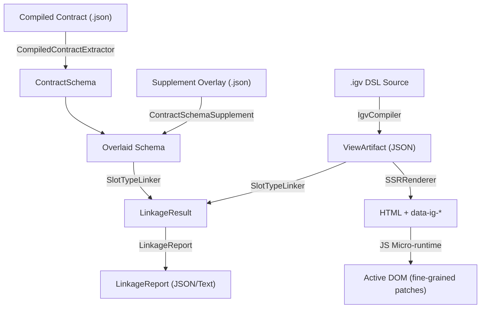

# Lab: Igniter View — Layer Consolidation and Readiness Map (v0)

> **Status:** experimental · lab-only · no-canon · no-public-api · no-stable-schema
> **Category:** view
> **Track:** lab-igniter-view-layer-consolidation-and-readiness-map-v0
> **Date:** 2026-06-07
> **Proof Baseline:** 405/405 PASS across P1/P2/P3/P5/P6/P7/P8/P9

---

## 1. Pipeline Overview

The Igniter View Framework (IVF) prototype coordinates three distinct phases to compile, validate, render, and hydrate component trees in the lab environment:

### Static Compilation & Contract Extraction Phase
1. **DSL Compile:** A `.igv` DSL file is processed by `IgvCompiler` into an isomorphic, content-addressed `ViewArtifact`.
2. **Contract Extraction:** The `CompiledContractExtractor` parses compiled contract JSON from the `<igapp>/contracts/` directory into a `ContractSchema`.
3. **Supplement Overlay:** `ContractSchemaSupplement` applies developer-authored metadata overlays (`item_fields`) onto the extracted `ContractSchema` to bridge compiled type limitations (such as opaque collection elements).

### Linkage & Diagnosis Phase
4. **Static Type Linker:** The `SlotTypeLinker` links the `ViewArtifact`'s slot declarations against the overlaid `ContractSchema` and verifies compatibility (types, slots, collection parameters).
5. **Unified Report:** `LinkageReport` aggregates extraction, overlay, and linking diagnostics into a unified text or JSON report for CI/CD or development environments.

### Isomorphic Rendering & Hydration Phase
6. **Server Render (SSR):** `SSRRenderer` consumes the `ViewArtifact` and slot data to emit static HTML with hydration dataset attributes (`data-ig-*`).
7. **Client Hydration:** The vanilla JS runtime (`igniter_view_runtime.js`) bootstraps from the embedded JSON script tags, attaches event handlers, and patches classes, ARIA, and data attributes in response to UIState changes.

---

## 2. Module Inventory & Readiness Map

This section classifies the readiness of the primary view engine modules. The lab readiness is evaluated using the following tiers:
*   **Proven-Lab:** Fully implemented and validated under regression gates with zero external dependencies.
*   **Draft-Lab:** Sketched or partially integrated, requiring full verification.
*   **Deferred:** Postponed to preserve a tight experimental focus.
*   **Closed:** Excluded by boundary design.

### Module Inventory

| Module | Location | Primary Role | Readiness Tier | Status Summary |
|:---|:---|:---|:---|:---|
| **ViewArtifact** | [view_artifact.rb](../../igniter-view-engine/lib/view_artifact.rb) | Isomorphic view artifact definition. Content-addressed. UIState, slots, elements, collections representation. | **Proven-Lab** | 100% test coverage. Enforces slot read-only rules and opcode whitelist. |
| **SSRRenderer** | [ssr_renderer.rb](../../igniter-view-engine/lib/ssr_renderer.rb) | Server-side renderer. Emits HTML and injections. Renders collection templates for client-side cloning. | **Proven-Lab** | Supports server-side evaluation of conditional display rules. No external framework dependencies. |
| **IgvCompiler** | [igv_compiler.rb](../../igniter-view-engine/lib/igv_compiler.rb) | Lexical Ruby DSL compiler. Produces isomorphic ViewArtifact JSON files. | **Proven-Lab** | Emits validation warnings for undeclared slots/states. Whitelists mutation opcodes. |
| **SlotTypeLinker** | [slot_type_linker.rb](../../igniter-view-engine/lib/slot_type_linker.rb) | Validates view slots against contract schemas. | **Proven-Lab** | Attributes typed diagnostics (errors/warnings) to slots and collections. |
| **CompiledContractExtractor** | [compiled_contract_extractor.rb](../../igniter-view-engine/lib/compiled_contract_extractor.rb) | Normalizes compiled contract output ports to contract schemas. | **Proven-Lab** | Direct type tag mapping to schema types. Generates missing_item_fields warning for collection types. |
| **ContractSchemaSupplement** | [contract_schema_supplement.rb](../../igniter-view-engine/lib/contract_schema_supplement.rb) | Merges hand-authored overrides to supplement compile-time type omissions. | **Proven-Lab** | Safeguards scalar output types from mutation. Attributes warnings for stale schemas. |
| **LinkageReport** | [linkage_report.rb](../../igniter-view-engine/lib/linkage_report.rb) | Consolidated report model and text/JSON formatters. | **Proven-Lab** | Excludes absolute machine paths for portable CI validation. |
| **JS Micro-runtime** | [igniter_view_runtime.js](../../igniter-view-engine/igniter_view_runtime.js) | Client-side engine. Hydrates HTML, evaluates rules, patches attributes. | **Proven-Lab** | Vanilla JS, zero-dependency. Strictly blocks innerHTML and eval. Tested via JSDOM. |
| **EBNF Grammar Sketch** | [igv-grammar-sketch-v0.ebnf](../../igniter-view-engine/docs/igv-grammar-sketch-v0.ebnf) | Language-agnostic DSL definition. | **Draft-Lab** | Documented sketch. No parsing engine currently implements it. |

---

## 3. Proof Coverage Matrix

All structural and dynamic features are covered by localized, offline Ruby and JS proof runners.

| Proof Runner | Focus Area | Checks | Status | Verified Assertions |
|:---|:---|:---:|:---:|:---|
| [`run_ivf_proof.rb`](../../igniter-view-engine/run_ivf_proof.rb) | P1 MVP Baseline | 37 | ✅ PASS | ViewArtifact structure, SSR HTML output, JS runtime security limits (no eval, no innerHTML), deterministic output. |
| [`run_ivf_proof_p2.rb`](../../igniter-view-engine/run_ivf_proof_p2.rb) | Live Slot Injection & Hydration | 33 | ✅ PASS | Slot updates, dataset hydration write-backs, parameter validation, warning console logs on digest mismatch. Includes 15 dynamic JSDOM checks. |
| [`run_ivf_proof_p3.rb`](../../igniter-view-engine/run_ivf_proof_p3.rb) | Compiler Pipeline & DSL | 42 | ✅ PASS | DSL parsing, compile-time opcode checks, invalid/malformed source handling, warning flags. |
| [`run_ivf_proof_p5.rb`](../../igniter-view-engine/run_ivf_proof_p5.rb) | Collection Rendering | 57 | ✅ PASS | Repeater loop rendering, template cloning without innerHTML, P1 tabs digest compatibility. Includes 19 JS DOM tests. |
| [`run_ivf_proof_p6.rb`](../../igniter-view-engine/run_ivf_proof_p6.rb) | Slot-Contract Type Linkage | 55 | ✅ PASS | Type compatibility, required fields check, extra/missing fields warnings. |
| [`run_ivf_proof_p7.rb`](../../igniter-view-engine/run_ivf_proof_p7.rb) | Compiled Contract Extraction | 57 | ✅ PASS | Normalization table mapping, malformed artifact recovery, drift reports against reference fixtures. |
| [`run_ivf_proof_p8.rb`](../../igniter-view-engine/run_ivf_proof_p8.rb) | Supplement Overlay merge | 66 | ✅ PASS | Hand-authored item_fields merge rules, scalar override rejection, stale entry warnings. |
| [`run_ivf_proof_p9.rb`](../../igniter-view-engine/run_ivf_proof_p9.rb) | Unified Diagnostic LinkageReport | 58 | ✅ PASS | Attributions to extractor/overlay/linker layers, portable JSON output (no paths), stable text formatter. |

---

## 4. Safety & Non-Claim Boundary Matrix

The IVF prototype is isolated behind explicit authority boundaries. It does not encroach upon the mainline language covenant or public runtime.

| Domain | Prototyped Behavior (Lab-Only) | Mainline Boundary (Non-Claims) |
|:---|:---|:---|
| **Language Covenant** | A sketch of EBNF grammar rules and experimental DSL syntax (`state`, `slot`, `element`, `collection`). | **No Mainline Authority:** The spec and covenant are owned by `igniter-lang`. These experiments create zero stable grammar or syntactic claims. |
| **API & Schema Stability** | Extracted and Supplement structures (contract JSON and overlay JSON). | **No Public API/Schema:** All JSON shapes are internal proof formats. No commitment is made to maintain compatibility. |
| **Runtime Execution** | Static Slot-Contract Linkage. | **No Runtime Authority:** The view engine has no access to VM memory, temporal timelines, or contract execution contexts. |
| **GUI & IDE Integration** | ViewArtifact serialized to JSON to support external IDE preview rendering. | **No Authority Transfer:** IDE interfaces and preview shells do not transfer view rendering logic or schema compiler authority. |
| **Security Fences** | whitelisted mutations (`set_ui_state`, `toggle_ui_state`, `clear_ui_state`), read-only slots, banned APIs (`eval`, `innerHTML`, `fetch`). | **Proof-Local Guards:** Security restrictions are implemented as build-time and hydration-time filters. They do not substitute for compiler-level capabilities. |

---

## 5. Cross-Category Relationship to GUI/IDE

The isomorphic layout of IVF bridges the gap between static view definitions and interactive previews:
1. **ViewArtifact as the Preview Source of Truth:** Serializing the component to JSON allows GUI renderers (Tauri, Svelte, or native platforms) to draw the components dynamically without compiling Ruby code or invoking a Ruby VM.
2. **Deterministic Display Rule Lowering:** Evaluating conditions on the server or client using a simple array representation makes the preview look consistent across terminals, web browsers, and Tauri shells.
3. **Linkage Diagnostics in the IDE:** The unified `LinkageReport` structure can be parsed by IDE plug-ins to overlay errors (e.g. `:slot_type_mismatch` or `:missing_required_item_field`) directly on `.igv` lines, without executing background runtime processes.

*Note: No rendering or compilation authority is transferred to the IDE; the view engine remains the compiler and diagnostic provider.*

---

## 6. Recommendations for Safe Next Routes

If the View Layer track is continued, four logical routes are available. The recommended option is **Option D: Track Pause** to allow other lab tracks to catch up with the diagnostic capabilities proven here.

### Option A: compiler-level report integration
*   **Description:** Integrate `LinkageReport.build_pipeline` into the primary `IgvCompiler.compile_file` API (e.g., `IgvCompiler.compile_file(path, report: true)` returning `{ artifact:, report: }`).
*   **Rationale:** Lowers friction for testing and compilation workflows.
*   **Risk:** Increases the compiler's surface area.

### Option B: IDE annotation & source-position format
*   **Description:** Add source-map tracking (line and column coordinates) to the `.igv` compiler AST and propagate coordinates to the `ViewArtifact` elements. Normalise `LinkageReport` entries to support an IDE-standard diagnostic format (e.g. `[file, line, col, severity, message]`).
*   **Rationale:** Connects static linking diagnostics to editor visual highlight markers.
*   **Risk:** Significantly increases the complexity of the compiler and serialized `ViewArtifact` schemas.

### Option C: Input form lowering (Targeted Next Step if continued)
*   **Description:** Lower basic HTML input elements (text fields, checkboxes) to map changes back to UIState. This would introduce a safe bidirectional binding without DOM `change` event listener leak hazards.
*   **Rationale:** Expands the readonly view engine into a simple data entry shell.
*   **Risk:** Introduces state synchronization issues.

### Option D: Track Pause (RECOMMENDED)
*   **Description:** Pause the `LAB-IGNITER-VIEW-FRAMEWORK` track. The static compilation, supplement validation, and unified diagnostics pipeline are fully proven in the lab (P1–P9).
*   **Rationale:** Allows other tracks (Tauri bridge, forms lowering, stdlib IO) to align with this baseline.
*   **Risk:** None.
